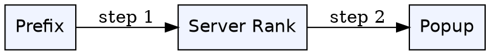
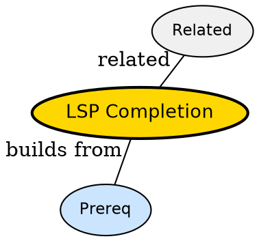

## The Problem

How does editor show function arguments after typing dot?

## Formal Definition

Per Wikipedia: "LSP completion is textDocument/completion request where client sends prefix and server returns completion items with label, kind and insertText."

## Explanation

Completion is waiter suggesting dishes -- you typed 'use', server suggests 'useState, useEffect'.

## How It Works

1. Trigger omnifunc or autotrigger
2. Client sends completion request with prefix
3. Server scores candidates
4. Client shows popup
5. User picks via CTRL-Y

## Visual Explanation



## Semantic Network



## Key Properties

- Trigger characters like . and (
- Fuzzy scoring server-side
- Snippet insert with placeholders

## Real-World Example

```python
vim.lsp.completion.enable(true, client.id, bufnr, {autotrigger=true})
```

## Connections

- **Built from:** [[lsp-server|LSP Server]] -- server provides items
- **Related:** [[lsp-client|LSP Client]] -- client requests
- **Builds into:** [[vim-lsp|Vim LSP]] -- vim shows popup
- **Contrasts with:** [[lsp-semantic-tokens|LSP Semantic Tokens]] -- completion vs highlighting

## Edge Cases & Gotchas

- Slow server -- completion lag blocks typing
- No triggerCharacters -- completion only on manual CTRL-X CTRL-O
