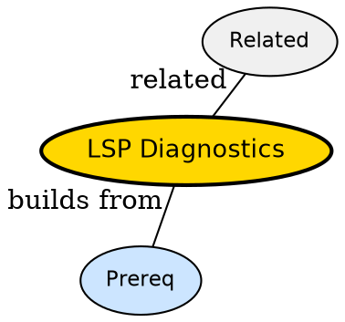

## The Problem

How do red squiggles appear instantly after typing a type error?

## Formal Definition

Per Wikipedia: "LSP diagnostics are push notifications publishDiagnostics that server sends when files change, carrying errors and warnings with ranges."

## Explanation

Server is proofreader -- as you type it marks mistakes and sends sticky notes with line numbers.

## How It Works

1. Buffer changes send didChange
2. Server re-analyzes file
3. Server sends publishDiagnostics
4. Client renders virtual text and signs
5. User jumps via diagnostic list

## Visual Explanation


## Semantic Network



## Key Properties

- Push not pull -- server decides when
- Ranges map to buffer lines
- Clear on fix -- server resends empty

## Real-World Example

```python
vim.diagnostic.config({virtual_text=true})
```

## Connections

- **Built from:** [[language-server-protocol|Language Server Protocol]] -- diagnostics is protocol method
- **Related:** [[lsp-events|LSP Events]] -- diagnostics ride on events
- **Related:** [[lsp-server|LSP Server]] -- server produces diagnostics
- **Builds into:** [[vim-lsp|Vim LSP]] -- vim renders

## Edge Cases & Gotchas

- Flooding -- large file sends many diagnostics throttles UI
- Stale diagnostics after server crash
