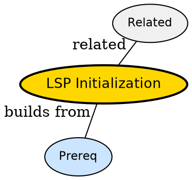

## The Problem

Server starts but does not know project root or capabilities -- how do they handshake?

## Formal Definition

Per Wikipedia: "Initialization is the initialize/initialized exchange where client sends rootUri and capabilities and server returns its capabilities."

## Explanation

Handshake like phone call -- client says who it is and what language it speaks, server says what help it can offer.

## How It Works

1. Client sends initialize with root and caps
2. Server responds with serverCapabilities
3. Client sends initialized notification
4. Server starts workspace indexing
5. Features become available

## Visual Explanation


## Semantic Network



## Key Properties

- Root from root_markers
- Capabilities negotiation prevents unsupported calls
- Once per attachment

## Real-World Example

```python
vim.lsp.enable('lua_ls') # triggers initialize
```

## Connections

- **Built from:** [[lsp-configuration|LSP Configuration]] -- config feeds init
- **Built from:** [[lsp-root-markers|LSP Root Markers]] -- root sent in init
- **Builds into:** [[lsp-diagnostics|LSP Diagnostics]] -- diagnostics after init
- **Related:** [[lsp-server|LSP Server]] -- server initializes

## Edge Cases & Gotchas

- Init before root detected -- server indexes wrong dir
- Advertising caps server lacks -- client calls missing method
