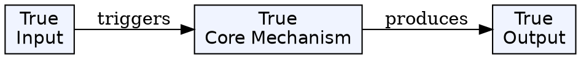
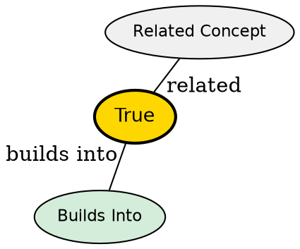

## The Problem

Syntax highlighting shows code structure (keywords, strings, comments) but not semantic meaning (is this a function? a class? deprecated?). Treesitter provides syntax-level highlighting, but LSP servers have additional semantic knowledge about the code that can enhance the editing experience.

## Core Idea

Semantic Tokens are LSP protocol extensions that let servers provide additional highlighting based on semantic meaning--identifying functions, variables, classes, parameters, and their modifiers (readonly, async, deprecated, etc.). This works alongside Treesitter, not replacing it.

## How It Works

1. Server advertises `textDocument/semanticTokens` capability during initialization
2. Server sends tokens as ranges with type (function, variable, class) and modifiers (readonly, async)
3. Neovim applies highlight groups: `@lsp.type.<type>.<filetype>`, `@lsp.mod.<mod>.<filetype>`
4. Can combine type+modifiers: `@lsp.typemod.<type>.<mod>.<filetype>`
5. LspTokenUpdate event fires when tokens change (for custom highlighting)

## Key Properties

- Adds to Treesitter highlighting, doesn't replace it
- Standard types: class, function, method, variable, parameter, etc.
- Standard modifiers: readonly, async, deprecated, static, abstract
- Highlight groups can be customized via `hi` or `nvim_set_hl`
- Priority: @lsp.type._ = semantic_tokens, @lsp.mod._ +1, @lsp.typemod.\* +2

## Visual Explanation

## Semantic Network

## Connections

- **Related:** [[treesitter|Treesitter]] -- provides syntax-level highlighting
- **Builds into:** [[lsp-events|LSP Events]] -- LspTokenUpdate for token changes
- **Related:** [[vim-lsp|vim.lsp]] -- handles semantic token integration

## Edge Cases & Gotchas

- Semantic highlights are additive to Treesitter--not a replacement
- Servers may use non-standard types/modifiers beyond the specification
- Disable by clearing highlight groups in ColorScheme autocmd
- LspTokenUpdate only supports highlight_token() call; other uses experimental