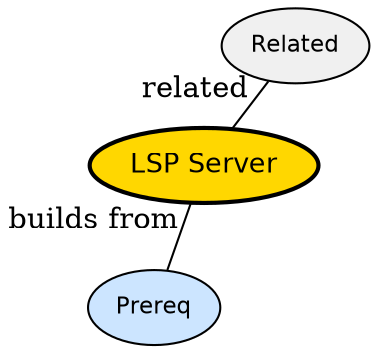

## The Problem

Editor knows syntax but not project types -- what provides hover, go-to-definition across files?

## Formal Definition

Per Wikipedia: "An LSP server is a process that implements Language Server Protocol to analyze workspace files and answer editor requests."

## Explanation

Server is the librarian -- editor asks where is definition of User, server knows every shelf in the project.

## How It Works

1. Client starts server via cmd
2. Client sends initialize with root
3. Server indexes workspace files
4. Client sends textDocument/hover etc
5. Server replies with location/markers

## Visual Explanation


## Semantic Network



## Key Properties

- Language-specific per project
- Runs out-of-process
- Communicates via JSON-RPC
- Advertises capabilities on init

## Real-World Example

```python
vim.lsp.config['clangd'] = {cmd={'clangd'}}
```

## Connections

- **Built from:** [[language-server-protocol|Language Server Protocol]] -- server speaks protocol
- **Related:** [[lsp-client|LSP Client]] -- client talks to server
- **Builds into:** [[lsp-semantic-tokens|LSP Semantic Tokens]] -- server provides tokens
- **Related:** [[lsp-configuration|LSP Configuration]] -- configures server

## Edge Cases & Gotchas

- Starting heavy server on huge monorepo slows init
- Mismatched filetypes -- server not attached
