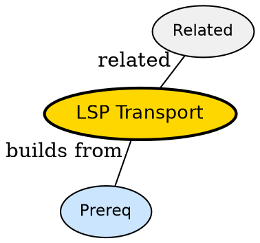

## The Problem

How do editor and server exchange messages without blocking UI?

## Formal Definition

Per Wikipedia: "LSP transport uses JSON-RPC over stdio or TCP with Content-Length headers to send requests, responses and notifications."

## Explanation

Like passing notes with envelope size on front -- length header tells reader where note ends.

## How It Works

1. Client encodes JSON-RPC with header
2. Writes to server stdin
3. Server reads Content-Length
4. Server decodes and dispatches
5. Server replies same way

## Visual Explanation


## Semantic Network



## Key Properties

- Stdio default in neovim
- TCP alternative for remote
- Header-based framing avoids delimiter issues

## Real-World Example

```python
Content-Length: 123\r\n\r\n{"jsonrpc":"2.0",...}
```

## Connections

- **Built from:** [[language-server-protocol|Language Server Protocol]] -- protocol needs transport
- **Related:** [[lsp-server|LSP Server]] -- server uses transport
- **Related:** [[lsp-client|LSP Client]] -- client uses transport
- **Contrasts with:** [[lsp-events|LSP Events]] -- events ride on transport

## Edge Cases & Gotchas

- Mixing stdout logs with transport corrupts stream
- Forgetting \r\n header causes hang
