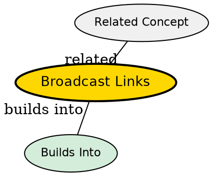

## The Problem
Multiple machines share a single physical communication channel (like WiFi or Ethernet). When one machine sends data, the signal physically reaches ALL machines on the channel. How do you ensure only the intended recipient processes the message?

## Core Idea
Every machine on the network receives every transmission. Each packet contains an **address field** specifying the intended recipient. Every machine checks the address -- if it matches, process the packet; if not, ignore it.

## How It Works
1. Sender puts data on the shared channel
2. The signal propagates to all connected nodes (physics of the medium)
3. Each node reads the destination address in the packet header
4. Only the addressed node processes the packet; all others discard it

## Key Properties
- **Single shared channel** -- only one transmission can happen at a time (or collisions occur)
- **Address-based filtering** -- all nodes see everything, but only the addressed node responds
- **No routing needed** -- no intermediate forwarding decisions; the channel itself delivers to all
- **Collision risk** -- if two nodes transmit simultaneously, the signals corrupt each other

## Visual Explanation

## Semantic Network

## Connections
- Contrasts with: [[point-to-point-links|Point-to-Point Links]] -- all-at-once vs pair-by-pair delivery
- Related: [[packet-switching|Packet Switching]] -- broadcast is the delivery mechanism on shared-media packet networks
- Related: [[osi-model-layers|OSI Model -- Seven Layers]] -- broadcast is primarily a Physical + Data Link layer concern
- Related: [[broadcast-links|Broadcast Links]] -- the address field mechanism is what makes broadcast work

## Edge Cases & Gotchas
- **Broadcast storms** -- if many nodes broadcast simultaneously, the channel becomes unusable
- **Privacy** -- in unencrypted broadcast networks, any node can eavesdrop on any other node's traffic
- **Modern Ethernet** -- switched Ethernet appears point-to-point but uses broadcast ARP and DHCP at the link layer
- **Not the same as broadcast addressing** -- sending to a special "all nodes" address is a deliberate broadcast, not the physical property of the medium