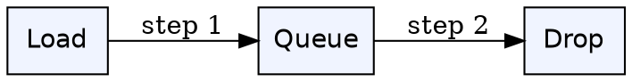
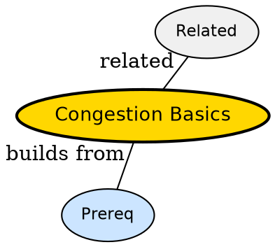

## The Problem

Packets are lost even though links are up -- why does network slow itself?

## Formal Definition

Per Wikipedia: "Congestion is overload when offered load exceeds capacity; queue builds, drops occur, goodput collapses without control."

## Explanation

Like traffic jam -- too many cars entering highway slows everyone, even those already on it.

## How It Works

1. Load increases
2. Buffers fill
3. Drops increase
4. Retransmits add load
5. Collapse without backoff

## Visual Explanation



## Semantic Network



## Key Properties

- Distinct from flow control (receiver) vs congestion (network)
- Needs feedback -- drops or ECN
- Backoff essential

## Real-World Example

```python
TCP backs off on loss
```

## Connections

- **Related:** [[circuit-switching|Circuit Switching]] -- circuit avoids congestion via reservation
- **Related:** [[packet-switching|Packet Switching]] -- packet suffers congestion
- **Builds into:** [[datagram-network|Datagram Network]] -- datagram needs congestion control
- **Related:** [[store-and-forward|Store-and-Forward]] -- congestion lives in buffers

## Edge Cases & Gotchas

- Adding bandwidth alone -- without control still collapses
- Confusing congestion with noise loss
