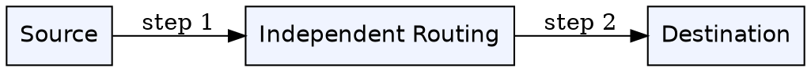
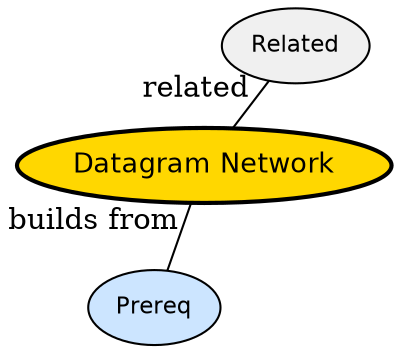

## The Problem

How does internet deliver without reserving a path first?

## Formal Definition

Per Wikipedia: "A datagram network treats each packet independently; each may take different path, no setup, no reservation."

## Explanation

Like postcards -- each mailed alone, may take different trucks, receiver reorders if needed.

## How It Works

1. App slices message into datagrams
2. Each stamped with destination
3. Routers forward independently
4. May arrive out of order
5. Destination reassembles

## Visual Explanation



## Semantic Network



## Key Properties

- No setup delay
- Robust -- alternate paths if link fails
- No bandwidth guarantee
- Needs sequence numbers

## Real-World Example

```python
IP forwarding per packet
```

## Connections

- **Built from:** [[packet-switching|Packet Switching]] -- datagram is packet switching style
- **Contrasts with:** [[circuit-switching|Circuit Switching]] -- circuit fixes path
- **Related:** [[store-and-forward|Store-and-Forward]] -- datagrams use store-forward
- **Related:** [[broadcast-links|Broadcast Links]] -- both are best-effort

## Edge Cases & Gotchas

- Assuming ordered delivery -- datagrams not ordered
- Thinking connection needed -- datagram is connectionless
