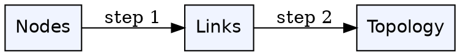
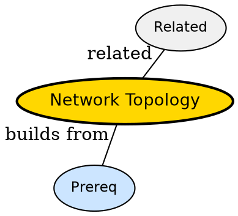

## The Problem

How does wiring shape which links can talk at once?

## Formal Definition

Per Wikipedia: "Topology describes how nodes and links are arranged -- bus, star, ring, mesh -- dictating broadcast domains and fault tolerance."

## Explanation

Topology is city road map -- layout decides which trips need a highway and where jams form.

## How It Works

1. Choose physical layout
2. Map broadcast vs point-to-point links
3. Identify single points of failure
4. Plan routing paths
5. Scale by adding nodes

## Visual Explanation



## Semantic Network



## Key Properties

- Star centralizes but fails at hub
- Mesh robust but costly
- Bus simple but collision prone
- Ring ordered but break anywhere hurts

## Real-World Example

```python
star -- hub connects all
```

## Connections

- **Related:** [[broadcast-links|Broadcast Links]] -- topology defines broadcasts
- **Related:** [[circuit-switching|Circuit Switching]] -- topology limits circuits
- **Builds into:** [[packet-switching|Packet Switching]] -- routing depends on topology
- **Related:** [[store-and-forward|Store-and-Forward]] -- store-forward at each hop

## Edge Cases & Gotchas

- Thinking logical equals physical -- VLAN vs cable differ
- Ignoring cost -- mesh for 100 nodes impossible
