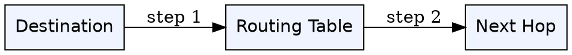
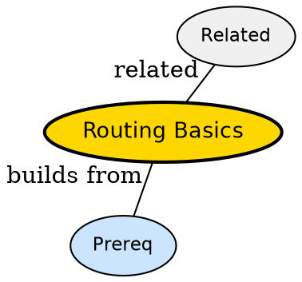

## The Problem

A packet has destination IP -- which next hop should router pick?

## Formal Definition

Per Wikipedia: "Routing chooses next hop using tables built from protocols that exchange reachability and compute shortest path."

## Explanation

Routing is GPS for packets -- each intersection consults map and forwards toward destination.

## How It Works

1. Router learns routes via protocol
2. Builds forwarding table
3. Looks up destination on arrival
4. Forwards via best next hop
5. Updates on topology change

## Visual Explanation



## Semantic Network



## Key Properties

- Decentralized -- each router decides
- Convergence time after failure
- Longest prefix match for IP
- May cause loops transiently

## Real-World Example

```python
ip route add 10.0.0.0/8 via 192.168.1.1
```

## Connections

- **Built from:** [[store-and-forward|Store-and-Forward]] -- routing decides where to forward
- **Related:** [[packet-switching|Packet Switching]] -- routing enables switching
- **Related:** [[datagram-network|Datagram Network]] -- datagrams need routing
- **Related:** [[network-topology|Network Topology]] -- topology informs routes

## Edge Cases & Gotchas

- Static routes stale after link fail
- Loop without TTL -- packet circles forever
