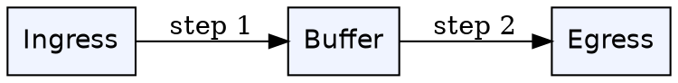
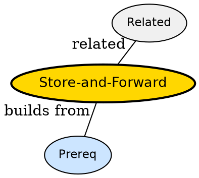

## The Problem

How do routers handle a packet that arrives faster than it can be sent out?

## Formal Definition

Per Wikipedia: "Store-and-forward buffers the entire packet before forwarding, enabling error check and rate adaptation."

## Explanation

Like post office -- clerk receives whole letter, checks address, then hands to next carrier, not letter-by-letter.

## How It Works

1. Packet arrives at input port
2. Stored in buffer
3. Checked for errors
4. Routing table consulted
5. Forwarded to output port

## Visual Explanation



## Semantic Network



## Key Properties

- Enables error detection
- Needs memory for queue
- Adds store delay
- Contrasts with cut-through

## Real-World Example

```python
packet -> buffer -> lookup -> forward
```

## Connections

- **Built from:** [[packet-switching|Packet Switching]] -- store-forward is packet technique
- **Contrasts with:** [[circuit-switching|Circuit Switching]] -- circuit reserves path
- **Related:** [[broadcast-links|Broadcast Links]] -- broadcasts still need buffering
- **Builds into:** [[packet-switching|Packet Switching]] -- refines

## Edge Cases & Gotchas

- Buffer bloat -- too much buffering adds latency
- Assuming zero copy -- actually copied
