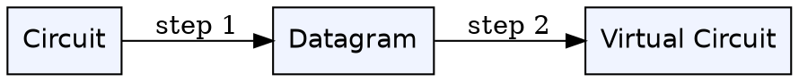
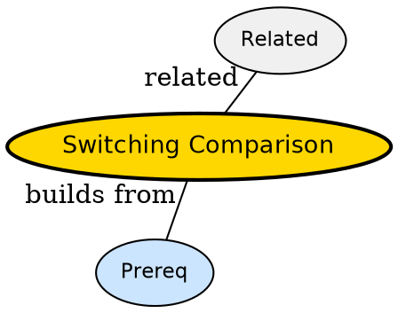

## The Problem

When do you pick circuit, packet/datagram or virtual circuit for a new network?

## Formal Definition

Per Wikipedia: "Comparison hinges on setup cost, resource sharing, ordering, robustness and flexibility across traffic types."

## Explanation

Circuit is private road, datagram is public road per car, virtual circuit is toll lane reservation.

## How It Works

1. List setup cost and delay
2. Compare sharing and utilization
3. Compare ordering guarantees
4. Check robustness to failures
5. Pick based on traffic -- voice vs bursty data

## Visual Explanation



## Semantic Network



## Key Properties

- Circuit good for steady voice
- Datagram good for bursty internet
- Virtual circuit good for ATM/MPLS
- No single best for all

## Real-World Example

```python
| Circuit | Datagram | VC |
```

## Connections

- **Built from:** [[circuit-switching|Circuit Switching]] -- one side
- **Built from:** [[packet-switching|Packet Switching]] -- another
- **Built from:** [[virtual-circuit-network|Virtual Circuit Network]] -- third
- **Builds into:** [[broadcast-links|Broadcast Links]] -- links affect switching

## Edge Cases & Gotchas

- Claiming one always best
- Ignoring signaling overhead
