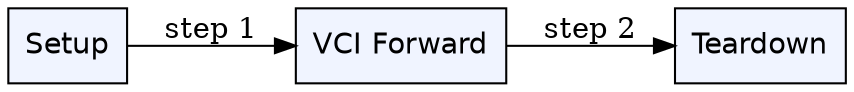
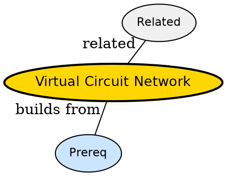

## The Problem

Need ordering but still want packet efficiency -- can we reserve a logical path without reserving bandwidth like circuit?

## Formal Definition

Per Wikipedia: "A virtual circuit network sets up a logical path before data, packets carry VCI and follow same path, combining setup with packet switching."

## Explanation

Like booking a train seat but not the whole train -- you have reserved route but share tracks.

## How It Works

1. Signal setup reserves VCI along path
2. Packets tag VCI not full address
3. Routers forward via VCI table
4. Packets arrive in order
5. Teardown releases VCIs

## Visual Explanation



## Semantic Network



## Key Properties

- Ordered delivery
- Per-flow state in routers
- Setup latency
- Fails if intermediate router reboots

## Real-World Example

```python
MPLS labels are VCIs
```

## Connections

- **Built from:** [[circuit-switching|Circuit Switching]] -- borrows setup idea
- **Built from:** [[packet-switching|Packet Switching]] -- borrows packet sharing
- **Contrasts with:** [[datagram-network|Datagram Network]] -- VC is connection-oriented
- **Related:** [[store-and-forward|Store-and-Forward]] -- VCs also store-forward

## Edge Cases & Gotchas

- Confusing with circuit -- VC shares bandwidth
- VCI reuse after teardown collides if stale
