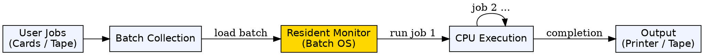
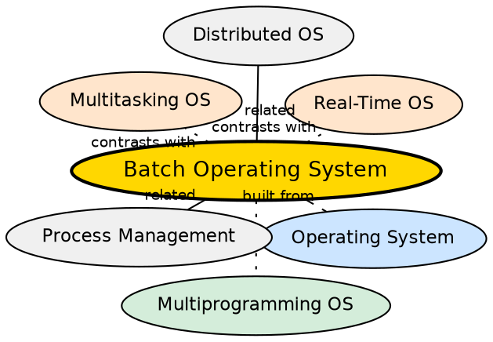

## Formal Definition

"Batch Operating System is an operating system in which similar jobs are grouped into batches and executed automatically without user interaction."

## Explanation

A batch OS was one of the earliest operating system types, designed for the era when computers were expensive, slow, and scarce. Instead of each user interactively running their program, jobs (punch cards or tape reels) were collected into a batch and submitted to the computer at once. The batch OS would load and execute each job automatically, one after another, without any user interaction during execution. When one job finished, the system immediately started the next. This maximized the utilization of the expensive computer by eliminating idle time between jobs. The tradeoff was that users had to wait — sometimes hours or days — for their output.

## How It Works

- Users submit jobs (programs + data) on punch cards or magnetic tape
- The operator collects jobs into a batch — grouping similar jobs together for efficiency
- The batch OS (resident monitor) loads the first job from the batch into memory
- The job executes to completion (or until an error) with no user interaction
- Output (results) is written to a printer or output tape
- The OS loads the next job automatically
- After all jobs in the batch complete, results are returned to users
- The resident monitor stays in memory and manages the job-to-job transition

## Visual Explanation

## Semantic Network

## Key Properties

- Jobs are grouped into batches and processed sequentially without user interaction
- Maximizes hardware utilization by eliminating manual job-switching idle time
- No interactivity — users submit jobs and come back later for results
- Resident monitor (a simple OS) manages job loading and execution
- Suitable for large, repetitive, non-interactive workloads (payroll, billing, report generation)
- Poor turnaround time — users may wait hours or days for output

## Connections

- Built from: [[operating-system|Operating System]] — batch OS is a historical type of OS
- Contrasts with: [[multiprogramming-operating-system|Multiprogramming Operating System]] — batch OS runs one job at a time; multiprogramming keeps many in memory and switches on I/O
- Contrasts with: [[multitasking-operating-system|Multitasking Operating System]] — batch OS has no interactivity; multitasking provides responsive user experience
- Contrasts with: [[real-time-operating-system|Real-Time Operating System]] — batch OS has no timing constraints; RTOS guarantees response deadlines
- Related: [[process-management|Process Management]] — even batch OS needs basic process management to load and execute jobs
- Related: [[distributed-operating-system|Distributed Operating System]] — both solve different aspects of maximizing resource utilization

## Edge Cases & Gotchas

- Batch OS is largely obsolete for general-purpose computing but survives in high-throughput computing (HPC batch schedulers like SLURM, PBS)
- A batch with a long-running job delays all subsequent jobs — no preemption
- Debugging was extremely painful: if a job failed, the programmer got a printout (core dump) hours later
- No priority mechanism — FIFO processing within the batch, though priority batch scheduling was later developed