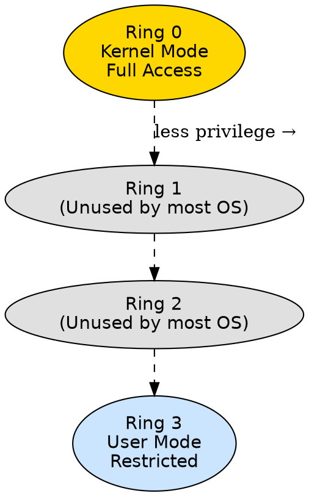
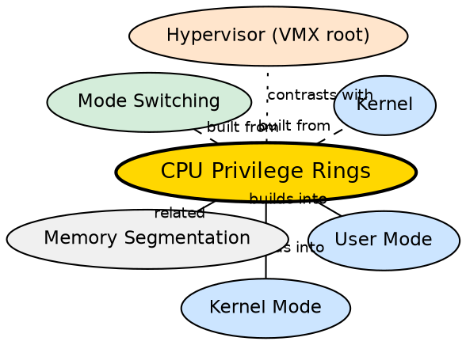

## Formal Definition

"Protection rings are a hierarchical mechanism to protect system data and functionality from faults and malicious behavior by restricting the privilege level at which code can execute."

## Explanation

CPU privilege rings are a hardware-enforced security model baked into the processor itself. Most modern architectures (x86, ARM) support multiple privilege levels — typically 4 rings on x86 (Ring 0 through Ring 3). The operating system uses only two: Ring 0 (kernel mode, most privileged) and Ring 3 (user mode, least privileged). Rings 1 and 2 exist in the hardware but are rarely used by mainstream OSes. The critical insight is that this protection is enforced by the CPU at the instruction level — even if a user-mode program tries to execute a privileged instruction, the CPU blocks it and raises an exception before any harm is done. This makes rings a fundamental building block of OS security.

## How It Works

- The current privilege level (CPL) is stored in a CPU register (CS register's RPL field on x86)
- Every memory segment and page has a descriptor privilege level (DPL) — the CPU checks CPL against DPL before allowing access
- Privileged instructions (LGDT, LIDT, HLT, IN, OUT, STI, CLI) can only execute at CPL 0
- When the OS boots, the CPU runs at CPL 0 (Ring 0) — the kernel sets up page tables, interrupt handlers, and process structures
- When launching a user process, the kernel sets CPL to 3 (Ring 3) and transfers control
- A syscall raises the CPL from 3 to 0; a return-from-interrupt lowers it back to 3
- The CPU automatically checks CPL on every instruction fetch and memory access — no software overhead for the check

## Visual Explanation

## Semantic Network

## Key Properties

- Hardware-enforced privilege separation — the CPU blocks unauthorized access at the instruction level
- x86 architecture defines 4 rings (0–3); most OSes use only 0 and 3
- Ring 0 has full access to all instructions and memory; Ring 3 is restricted
- Rings 1 and 2 exist in hardware but are unused by mainstream OSes (some microkernels or virtualization solutions use them)
- The current privilege level is tracked by the CPU on every instruction
- Attempting a privileged instruction from a lower ring triggers a general protection fault (#GP)

## Connections

- Built from: [[kernel|Kernel]] — the kernel sets up and manages the privilege ring configuration
- Builds into: [[user-mode|User Mode]] — user mode corresponds to Ring 3
- Builds into: [[kernel-mode|Kernel Mode]] — kernel mode corresponds to Ring 0
- Builds into: [[mode-switching|Mode Switching]] — ring transitions are what mode switching fundamentally is
- Contrasts with: [[hypervisor|Hypervisor]] — hypervisors run at a new "Ring -1" (VMX root mode) introduced by virtualization extensions
- Related: [[system-calls|System Calls]] — system calls are the controlled mechanism for Ring 3 → Ring 0 transitions

## Edge Cases & Gotchas

- Some OSes (like OS/2) used Rings 1 and 2 — modern OSes do not, but the hardware still supports them
- Virtualization extensions (Intel VT-x, AMD-V) add a ring below 0 called "Ring -1" (VMX root) for hypervisors
- ARM architectures have EL0 (user), EL1 (kernel), EL2 (hypervisor), EL3 (secure monitor) — a different naming but same concept
- A program cannot simply "lower" its CPL — the CPU prevents this; only an interrupt/syscall gate can change CPL to a more privileged level