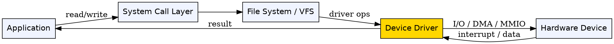
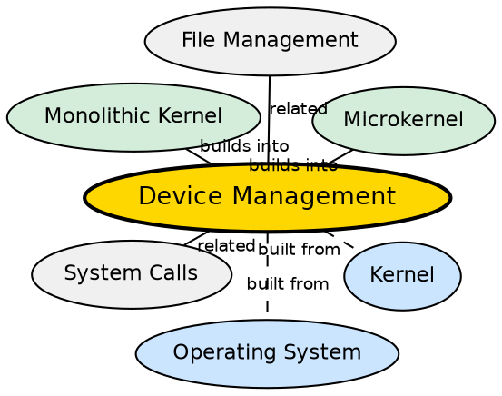

## Formal Definition

"Device Management is the function of an operating system that handles communication with hardware peripherals through device drivers and provides a uniform interface to applications."

## Explanation

Device management is the OS function that controls all hardware peripherals — keyboard, mouse, display, disk, printer, GPU, network card. Applications cannot (and should not) talk directly to hardware, because each device has a different protocol, register layout, and behavior. Instead, the OS provides device drivers — specialized software that knows how to communicate with a specific piece of hardware. Applications interact with devices through the OS's standardized abstractions (e.g., read/write to a file descriptor for disk, sockets for network). This allows a programmer to write `open("file.txt")` without knowing whether the disk is SSD or HDD, SATA or NVMe.

## How It Works

- A device driver is loaded into the OS (in kernel space for monolithic kernels, user space for microkernels)
- When an application performs a device-related system call (e.g., `read` from a keyboard, `write` to a file), the kernel routes it to the appropriate driver
- The driver communicates with the hardware using I/O ports, memory-mapped I/O, or DMA (Direct Memory Access)
- For input devices, the hardware sends interrupts — the CPU stops its current work, the kernel's interrupt handler processes the input, and the result is delivered to the waiting application
- For output, the kernel may buffer data (e.g., network packets, disk writes) for efficiency
- The OS provides a uniform interface (device files in Unix, device objects in Windows) so applications don't need device-specific code

## Visual Explanation

## Semantic Network

## Key Properties

- Device drivers translate generic OS I/O requests into hardware-specific commands
- Communication methods: programmed I/O (CPU busy-waits), interrupt-driven I/O (CPU notified), DMA (device writes directly to RAM)
- Uniform interface: applications use the same read/write API for files, devices, and sockets
- In monolithic kernels, drivers run in kernel mode (performance, but risky); in microkernels, drivers run in user mode (safer, slower)
- Plug-and-Play allows automatic detection and driver loading for newly connected devices

## Connections

- Built from: [[kernel|Kernel]] — the kernel manages device drivers and I/O routing
- Built from: [[operating-system|Operating System]] — device management is a core OS function
- Builds into: [[monolithic-kernel|Monolithic Kernel]] — device drivers run in kernel space in monolithic kernels
- Builds into: [[microkernel|Microkernel]] — device drivers run in user space in microkernels
- Related: [[system-calls|System Calls]] — device access is mediated by system calls (read, write, ioctl)
- Related: [[file-management|File Management]] — the file system often sits atop block device drivers

## Edge Cases & Gotchas

- A buggy device driver in a monolithic kernel can crash the entire OS — this is the primary motivation for microkernels
- DMA can bypass the CPU and write data directly to memory — while efficient, it creates security concerns (a malicious device could modify kernel memory)
- Device drivers are the largest source of OS bugs (more than the kernel core) because they are written by third parties with varying quality
- Power management requires close coordination between device drivers and the kernel (e.g., suspending a disk when unused)