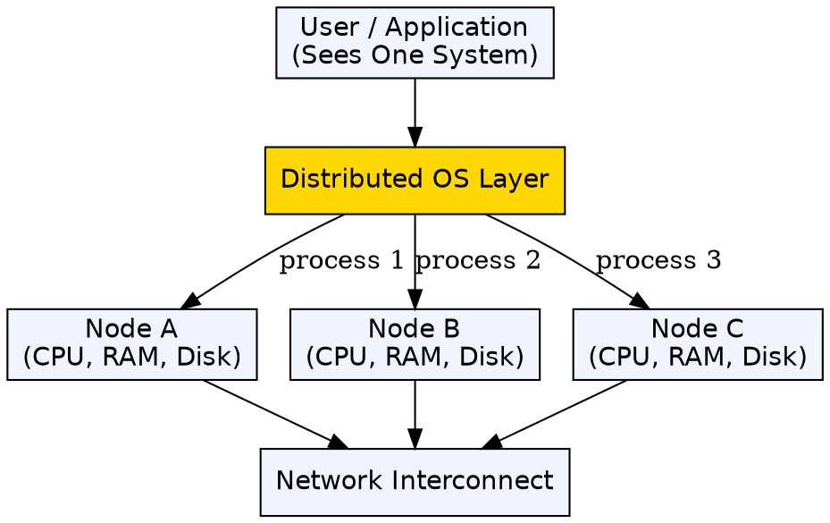
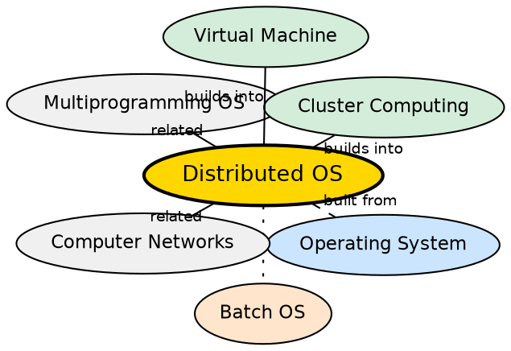

## Formal Definition

"A Distributed Operating System manages multiple independent computers and makes them appear as a single system."

## Explanation

A distributed OS connects multiple independent computers over a network and presents them to the user as a single unified system. Instead of logging into one machine, the user sees one pool of resources — CPU cores, memory, storage — spread across many physical machines. The OS handles task distribution, data replication, fault tolerance, and consistency transparently. This is fundamentally different from a network of standalone computers, where each machine is managed separately. True distributed OSes are rare (Plan 9, Amoeba) but the concept heavily influences modern distributed systems infrastructure (Kubernetes, distributed databases, cloud computing platforms).

## How It Works

- Multiple computers (nodes) are connected via a high-speed network
- A distributed OS layer runs on each node, coordinating with others through message passing
- A global scheduler distributes processes across nodes — the user does not choose which node runs their task
- The file system is distributed: a file may be stored across multiple nodes, with replication for fault tolerance
- Memory can be shared across nodes via distributed shared memory (DSM) — each node sees a single address space
- If a node fails, the OS transparently migrates its tasks to other nodes and redirects resource requests
- Clock synchronization (NTP) and consensus algorithms (Paxos, Raft) maintain consistency across nodes

## Visual Explanation

## Semantic Network

## Key Properties

- Multiple independent computers appear as one unified system
- Transparent resource sharing: processes, files, and memory are distributed across nodes
- Fault tolerance: node failure does not stop the system — tasks migrate to surviving nodes
- Scalability: adding more nodes increases total capacity
- Requires consensus algorithms (Paxos, Raft) for coordination and consistency
- True distributed OSes are rare — most modern "distributed systems" use networked standalone OSes with middleware (Kubernetes, Spark)

## Connections

- Built from: [[operating-system|Operating System]] — a distributed OS extends OS concepts across multiple machines
- Built from: [[batch-operating-system|Batch Operating System]] — batch processing at scale is a distributed computing problem
- Contrasts with: [[multitasking-operating-system|Multitasking Operating System]] — multitasking shares CPU on one machine; distributed OS shares across machines
- Builds into: [[virtual-machine|Virtual Machine]] — VMs are building blocks for distributed infrastructure (cloud)
- Related: [[inter-process-communication|Inter-Process Communication]] — IPC across nodes (network communication) is fundamental to distributed OS
- Related: [[security-and-protection|Security and Protection]] — distributed OS must secure communication and authenticate nodes

## Edge Cases & Gotchas

- Network partitions are the hardest problem in distributed systems — a split network creates split-brain scenarios (two nodes both think they are the leader)
- True distributed OSes (Plan 9, Amoeba) never achieved mainstream adoption — most modern systems use "networked OS" + middleware
- Latency across nodes is orders of magnitude higher than local memory access — distributed algorithms must account for this
- Partial failure is the defining challenge: some nodes may fail while others continue, and the system must detect and handle this gracefully