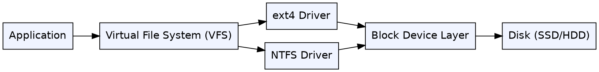
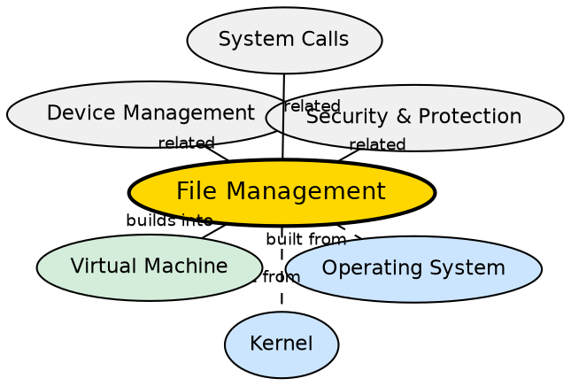

## Formal Definition

"File Management is the function of an operating system that handles the creation, deletion, reading, writing, and organization of files on storage devices."

## Explanation

File management turns a raw block storage device (SSD, HDD) into a structured, named hierarchy of files and directories. Without it, storing data would mean tracking raw sector numbers manually. The OS's file system organizes data into files (named byte sequences) and directories (containers for files), manages permissions, handles disk space allocation, and ensures data integrity. The file system also provides a uniform API (open, read, write, close) so applications work the same way across different storage hardware. Popular file systems include ext4, NTFS, APFS, and FAT32.

## How It Works

- The OS implements a Virtual File System (VFS) layer that provides a common interface for all file system types
- When a file is created, the file system allocates space on disk: metadata (inode in Unix) stores file attributes (size, permissions, timestamps, block pointers)
- Directories are special files that map filenames to inode numbers
- On read, the OS translates the file path to an inode, reads the block pointers, and fetches the data blocks from disk
- The file system manages free space using bitmaps or free lists, and handles fragmentation
- Permissions (read/write/execute for owner/group/others) are checked on every file access against the process's credentials
- Journaling or copy-on-write mechanisms protect against corruption during crashes

## Visual Explanation

## Semantic Network

## Key Properties

- Provides a hierarchical namespace (directories/files) over raw block storage
- VFS abstraction allows multiple file system types to coexist (ext4, NTFS, FAT32, etc.)
- Metadata (inodes or MFT entries) stores file attributes separate from file data
- Permissions are enforced per file: read/write/execute for owner, group, and others
- Journaling ensures crash recovery: metadata updates are logged before being applied
- Common operations: create, open, read, write, seek, close, delete, truncate

## Connections

- Built from: [[operating-system|Operating System]] — file management is a core OS function
- Built from: [[kernel|Kernel]] — the kernel's VFS and file system drivers implement file operations
- Builds into: [[virtual-machine|Virtual Machine]] — virtual disks are files on the host file system
- Related: [[device-management|Device Management]] — file systems sit atop block device drivers
- Related: [[system-calls|System Calls]] — all file operations go through system calls (open, read, write, close)
- Related: [[security-and-protection|Security and Protection]] — file permissions are a key OS security mechanism

## Edge Cases & Gotchas

- File deletion does NOT erase data — it removes metadata pointers; the data remains on disk until overwritten (this is how file recovery tools work)
- Fragmentation slows down file access over time — SSDs handle fragmentation differently than HDDs (seek time penalty is negligible on SSDs)
- Maximum file size and maximum volume size vary by file system (FAT32: 4 GB per file; ext4: 16 TB; NTFS: 256 TB)
- Hard links vs symlinks: hard links share the same inode (same data), symlinks are path-based references (can dangle or cross file systems)