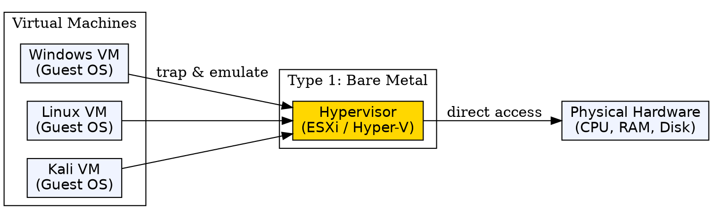
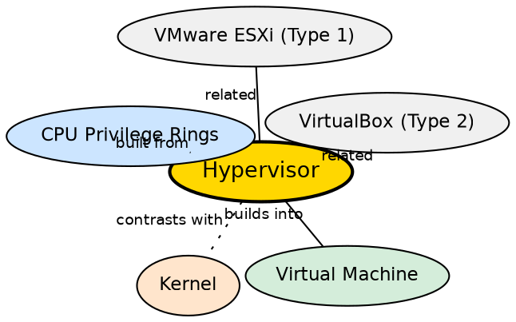

## Formal Definition

"A Hypervisor is software or firmware that creates and manages virtual machines by allocating hardware resources."

## Explanation

A hypervisor (also called a Virtual Machine Monitor or VMM) is the layer that makes virtualization possible. It sits between the physical hardware and the virtual machines, abstracting the underlying hardware into virtualized resources. Each VM believes it has its own dedicated CPU, RAM, disk, and network card, but the hypervisor is actually multiplexing the real hardware. Hypervisors come in two flavors: Type 1 (bare metal) runs directly on hardware without a host OS (used in servers and cloud — VMware ESXi, Hyper-V) and Type 2 (hosted) runs on top of an existing OS (used by developers — VirtualBox, VMware Workstation). The hypervisor handles resource allocation, VM isolation, and the translation of guest OS instructions to physical hardware operations.

## How It Works

- Type 1 hypervisor is installed directly on hardware — it includes its own minimal device drivers and scheduler
- Type 2 hypervisor runs as a process on a host OS — the host OS handles hardware; the hypervisor manages VMs on top
- When a VM starts, the hypervisor allocates virtual CPU cores (vCPUs), virtual RAM, and virtual storage
- The guest OS inside the VM issues instructions that the hypervisor intercepts; most instructions execute directly on the CPU (hardware-assisted virtualization via Intel VT-x / AMD-V)
- Privileged instructions from the guest OS are trapped by the CPU and handled by the hypervisor (trap-and-emulate)
- The hypervisor ensures VM isolation: one VM cannot read another VM's memory or access its storage
- For Type 2, the hypervisor process itself runs in user mode on the host, adding a layer of overhead

## Visual Explanation

## Semantic Network

## Key Properties

- Type 1 (bare-metal): runs directly on hardware, no host OS, enterprise/cloud use
- Type 2 (hosted): runs as a process on a host OS, development/testing use
- Provides hardware abstraction: each VM gets virtualized CPU, RAM, disk, and network
- Enforces strong isolation between VMs — one VM cannot access another VM's resources
- Uses hardware virtualization extensions (Intel VT-x, AMD-V) for efficient guest execution
- Manages resource allocation: CPU scheduling, memory ballooning, disk provisioning

## Connections

- Built from: [[cpu-privilege-rings|CPU Privilege Rings]] — hypervisors use a new privilege level (Ring -1 via VT-x/AMD-V)
- Builds into: [[virtual-machine|Virtual Machine]] — hypervisors create and manage VMs
- Contrasts with: [[kernel|Kernel]] — a kernel manages processes on one OS; a hypervisor manages multiple OSes on one machine
- Related: [[kernel-mode|Kernel Mode]] — Type 1 hypervisors run in a privilege mode below kernel mode
- Related: [[mode-switching|Mode Switching]] — VM exits (guest→hypervisor) are a form of mode switch with high overhead
- Related: [[device-management|Device Management]] — hypervisors virtualize hardware devices for guest OSes

## Edge Cases & Gotchas

- Type 2 hypervisors have double overhead: guest → hypervisor → host OS → hardware, making them slower for I/O-intensive workloads
- Paravirtualization (guest OS knows it's virtualized and uses special hypercalls) can outperform full hardware emulation
- Nested virtualization (running a hypervisor inside a VM) is possible but complex and slow
- The "hypervisor" is NOT the same as a "virtual machine" — the hypervisor creates and manages VMs, it is not itself a VM