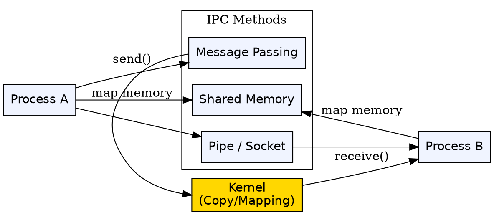
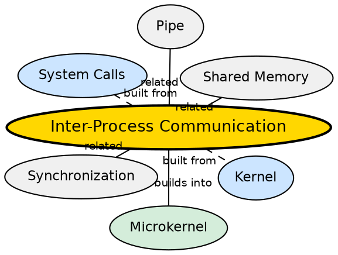

## Formal Definition

"Inter-Process Communication (IPC) is a mechanism that allows processes to communicate with each other and synchronize their actions, typically through message passing or shared memory."

## Explanation

IPC is the nervous system of a multi-process operating system. Since each process has its own isolated virtual address space (for security and stability), they cannot directly access each other's data. IPC provides controlled channels for processes to exchange data, send signals, and coordinate. IPC is especially critical in microkernel architectures, where even fundamental OS services like file systems and drivers run as separate processes and must communicate with each other and with applications. Key IPC mechanisms include message passing, shared memory, semaphores, pipes, sockets, and signals.

## How It Works

- Processes use message passing: process A sends a message, the kernel copies it to process B's address space
- Shared memory: the kernel maps a region of physical memory into the address spaces of both processes, allowing direct reads and writes
- Pipes: a unidirectional or bidirectional byte stream (e.g., `ls | grep foo` in Unix shells)
- Sockets: IPC across a network (or locally via Unix domain sockets) — the same API used for network communication
- Semaphores and mutexes: synchronization primitives that coordinate access to shared resources
- In microkernels, IPC is the fundamental communication primitive — all service requests travel through IPC channels
- The kernel validates each IPC operation to prevent unauthorized data access between processes

## Visual Explanation

## Semantic Network

## Key Properties

- Enables data exchange and coordination between isolated processes
- Primary mechanisms: message passing, shared memory, pipes, sockets, signals
- Message passing involves kernel-mediated copying — slower but fully isolated
- Shared memory is faster but requires explicit synchronization (semaphores, mutexes)
- IPC is the backbone of microkernel architectures — all OS services communicate via IPC
- IPC operations (especially message passing) are more expensive than direct function calls due to kernel involvement

## Connections

- Built from: [[kernel|Kernel]] — the kernel implements and mediates IPC mechanisms
- Built from: [[system-calls|System Calls]] — IPC operations are accessed via system calls (send, receive, mmap, pipe)
- Builds into: [[microkernel|Microkernel]] — microkernels rely on IPC as their primary communication mechanism between user-space services
- Contrasts with: [[monolithic-kernel|Monolithic Kernel]] — in monolithic kernels, internal services use direct function calls, not IPC
- Related: [[mode-switching|Mode Switching]] — IPC between processes involves mode switches (user→kernel→user)
- Related: [[process-management|Process Management]] — processes are the endpoints of IPC

## Edge Cases & Gotchas

- IPC over shared memory looks like direct access but requires synchronization — without mutexes, two processes could corrupt shared data
- Message passing has overhead from context switching and data copying — zero-copy IPC techniques (like memory-mapped files) mitigate this
- Pipes are unidirectional by default — bidirectional communication requires two pipes
- Performance of IPC is critical in microkernels: L4 microkernel optimizes IPC to ~50-100 instructions per call
- Deadlocks can occur if two processes wait on each other's IPC responses indefinitely

## Sources

- [[os-summary|OS Source Summary]]
