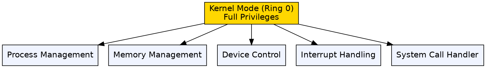
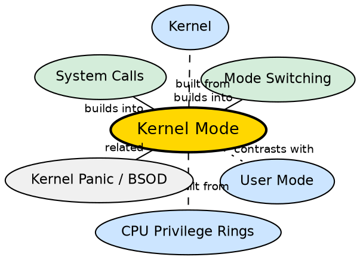

## Formal Definition

"Kernel mode is the privileged mode of execution in which the operating system kernel runs with unrestricted access to hardware and system resources."

## Explanation

Kernel mode is the highest privilege level in a modern operating system. When the CPU runs in kernel mode, it can execute any instruction, access any memory address, and control any hardware device. This unrestricted access is necessary because the kernel must manage all system resources — but it is also dangerous: a single bug in kernel mode can crash the entire system (kernel panic or BSOD). Only the operating system kernel and trusted kernel modules run in kernel mode; everything else runs in user mode. The CPU enforces this separation at the hardware level, so even a malicious application cannot simply "switch itself" to kernel mode.

## How It Works

- At boot, the CPU starts in kernel mode; the OS kernel initializes all hardware
- When the OS launches a user process, it sets the CPU mode bit to user mode before handing control over
- The kernel remains in memory, and when a system call or hardware interrupt occurs, the CPU switches back to kernel mode
- In kernel mode, the kernel can access any physical memory address, execute privileged instructions (LGDT, LIDT, HLT, IN/OUT), and directly interact with hardware
- The kernel handles interrupts: when a key is pressed, the hardware signals an interrupt, the CPU switches to kernel mode, and the kernel's interrupt handler processes the input
- Kernel mode code must be extremely careful — there is no protection boundary separating it from the hardware, so memory corruption can be catastrophic

## Visual Explanation

## Semantic Network

## Key Properties

- Full access to all hardware, memory, and CPU instructions
- Only the kernel and its trusted modules execute here
- Errors in kernel mode can crash the entire OS (kernel panic / BSOD)
- The CPU enforces mode separation at the hardware level — user code cannot arbitrarily switch to kernel mode
- Hardware interrupts are handled in kernel mode
- Switching to kernel mode is expensive (hundreds of CPU cycles) due to context save/restore

## Connections

- Built from: [[cpu-privilege-rings|CPU Privilege Rings]] — kernel mode corresponds to Ring 0, the most privileged ring
- Built from: [[kernel|Kernel]] — the kernel runs in kernel mode exclusively
- Contrasts with: [[user-mode|User Mode]] — user mode has restricted privileges; kernel mode has full privileges
- Builds into: [[mode-switching|Mode Switching]] — every system call transitions from user to kernel mode and back
- Builds into: [[system-calls|System Calls]] — the kernel-mode handler processes system calls
- Related: [[monolithic-kernel|Monolithic Kernel]] — in monolithic kernels, more code runs in kernel mode (increasing crash risk)

## Edge Cases & Gotchas

- Not all code in the OS runs in kernel mode — the GUI, terminal, and most utilities run in user mode
- Kernel mode is NOT the same as the "OS" — it is a CPU privilege level, not a visual or conceptual layer
- A bug in a kernel-mode device driver can crash the OS even if the kernel itself is perfect — this is why microkernels move drivers to user space
- Some CPUs support virtualization extensions (Intel VT-x, AMD-V) that add a "root mode" below Ring 0 for hypervisors

## Sources

- [[os-summary|OS Source Summary]]
