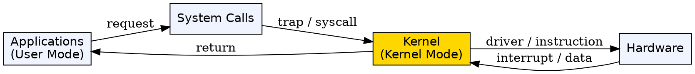
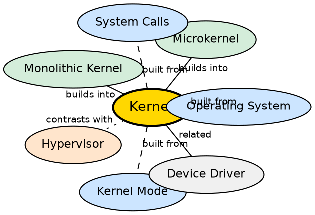

## Formal Definition

"The Kernel is the central part of an operating system that manages computer hardware resources and provides essential services to application software."

"Kernel is the core component of an Operating System that manages system resources and acts as an interface between hardware and software. It controls CPU, memory, devices, and system operations."

## Explanation

The kernel is the trusted core of the operating system — the only component that runs in kernel mode with full hardware access. Every other part of the system (applications, utilities, even the GUI) runs in user mode and must ask the kernel to perform privileged operations. Without the kernel, there is no coordination: multiple programs would fight over the CPU, clobber each other's memory, and access hardware unsafely. The kernel solves this by being the single authority that manages processes, memory, devices, and security.

## How It Works

- The kernel is loaded into memory at boot time and remains resident for the entire system session
- It handles process management: creating, scheduling, and terminating processes with algorithms like round-robin or priority scheduling
- It manages memory: allocating RAM to processes, enforcing protection boundaries, and handling paging/virtual memory
- It controls device access: all hardware communication goes through device drivers that live inside (monolithic) or communicate with (microkernel) the kernel
- It provides a system call interface — a controlled entry point — so that user-space programs can request privileged operations
- The kernel also handles interrupts: hardware signals (keyboard press, timer tick) are caught by the kernel and routed to the appropriate handler

## Visual Explanation

## Semantic Network

## Key Properties

- Runs in the most privileged CPU mode (Ring 0 / kernel mode)
- Manages processes, memory, devices, and files
- Provides system calls as a secure gateway for user-space requests
- Loaded at boot and stays in memory (resident)
- Can be monolithic, micro, or hybrid in architecture
- Is a strict subset of the full operating system

## Connections

- Built from: [[operating-system|Operating System]] — the OS contains the kernel as its core component
- Built from: [[kernel-mode|Kernel Mode]] — the kernel executes in kernel mode with full privileges
- Builds into: [[system-calls|System Calls]] — the kernel exposes system calls for user-space interaction
- Builds into: [[monolithic-kernel|Monolithic Kernel]] — one architectural pattern where all kernel services run in kernel space
- Builds into: [[microkernel|Microkernel]] — an alternative pattern where only essential services run in kernel space
- Contrasts with: [[hypervisor|Hypervisor]] — a hypervisor manages VMs, while a kernel manages processes on one OS
- Related: [[user-mode|User Mode]] — the restricted mode where applications run, contrasted with kernel mode

## Edge Cases & Gotchas

- "Kernel" is often confused with "Operating System" — the kernel is a subset; the OS includes shell, utilities, libraries, and GUI
- A kernel panic (Linux) or BSOD (Windows) occurs when the kernel encounters a fatal error — any bug in kernel mode can crash the entire system
- Microkernels reduce crash surface by moving services to user space, but pay a performance cost from IPC overhead
- Modern Linux uses a monolithic kernel with dynamically loadable modules, blurring the pure monolithic vs microkernel distinction