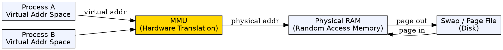
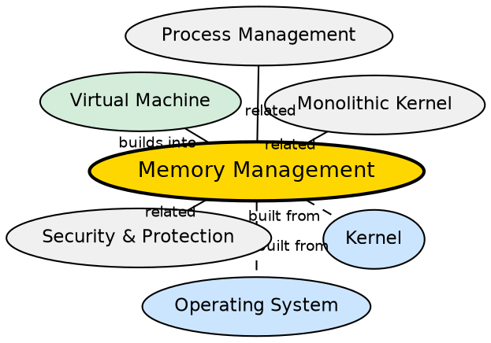

## Formal Definition

"Memory Management is the function of an operating system that handles the allocation and deallocation of memory space to processes and ensures protection between them."

## Explanation

Memory management is the OS function that acts as the traffic controller for RAM. Physical RAM is limited (typically 4-64 GB on modern systems), and multiple processes must share it without interfering with each other. The OS's memory manager allocates memory to processes when they start, tracks which parts of RAM are free or in use, deallocates memory when processes terminate, and most importantly, enforces protection so that Process A cannot read or write Process B's memory. Modern OSes use virtual memory, giving each process its own private address space and mapping it to physical RAM through page tables. This provides both isolation and the illusion of nearly unlimited memory (via paging to disk).

## How It Works

- The OS maintains a page table for each process, mapping virtual addresses to physical memory frames
- When a process requests memory (e.g., via `malloc`), the kernel allocates pages (typically 4 KB each) and maps them into the process's virtual address space
- The Memory Management Unit (MMU) in the CPU performs the virtual-to-physical translation on every memory access
- If a process accesses a virtual page not currently in physical RAM, a page fault occurs — the OS loads the page from disk (swap) into RAM
- The OS prevents one process from accessing another process's pages because page tables are process-specific and the kernel controls them
- When memory is tight, the OS uses page replacement algorithms (LRU, Clock, Working Set) to decide which pages to evict to disk

## Visual Explanation

## Semantic Network

## Key Properties

- Each process has an isolated virtual address space mapped to physical pages via page tables
- The MMU handles address translation in hardware — no software overhead on each memory access
- Page faults trigger OS intervention to load pages from disk swap
- Page replacement algorithms (LRU, Clock, FIFO, Working Set) manage memory pressure
- Memory protection is hardware-enforced: the CPU checks page-level permissions on every access
- Virtual memory allows overcommitting: processes can allocate more virtual memory than physical RAM exists

## Connections

- Built from: [[kernel|Kernel]] — the kernel's memory manager implements all memory operations
- Built from: [[operating-system|Operating System]] — memory management is a core OS function
- Builds into: [[virtual-machine|Virtual Machine]] — hypervisors manage virtual RAM for each VM using memory management techniques
- Related: [[process-management|Process Management]] — processes need memory to execute; scheduling and memory management interact closely
- Related: [[security-and-protection|Security and Protection]] — memory protection is a fundamental security mechanism
- Related: [[monolithic-kernel|Monolithic Kernel]] — in monolithic kernels, memory management calls other components via direct function calls

## Edge Cases & Gotchas

- Memory leaks in applications cause gradual memory pressure; the OS cannot fix this — it must keep allocating until OOM killer activates
- Thrashing occurs when the system spends more time swapping pages to/from disk than executing code — the system effectively freezes
- Fragmentation: external fragmentation (free memory split into small chunks) can prevent large allocations despite total free space being sufficient
- Kernel memory is separate from user memory and cannot be swapped out — a bug in kernel memory management can crash the OS