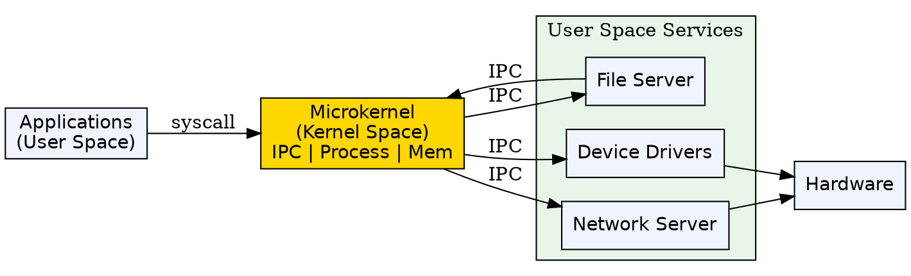
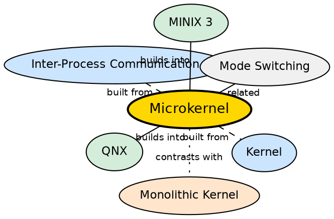

## Formal Definition

"A Microkernel is a type of operating system architecture in which only essential services run in kernel space, while other services run in user space."

"A microkernel provides minimal operating system functionality such as process management, memory management, and communication, while services like device drivers and file systems execute outside the kernel."

## Explanation

A microkernel is the philosophical opposite of a monolithic kernel. It follows the principle of minimality: keep the kernel as small as possible. Only the absolutely essential services — process management, basic memory management, inter-process communication (IPC), and interrupt handling — stay in kernel mode. Everything else (file systems, device drivers, network stacks, system services) runs as regular user-space processes. This drastically reduces the attack surface and crash surface: a buggy graphics driver cannot crash the kernel because it runs with user-level privileges. The tradeoff is performance — communication between components requires IPC and multiple mode switches, which is slower than the direct function calls in a monolithic kernel.

## How It Works

- The microkernel provides only a few core services: IPC, low-level process/thread management, and interrupt dispatching
- Other OS services (file server, network server, device drivers) run as separate user-space processes
- When an application needs a service, the request flows: application → microkernel (via syscall) → service process (via IPC) → microkernel → hardware
- Each message crossing requires a mode switch — the application to kernel, kernel to service, service back to kernel, kernel to application
- IPC in microkernels is carefully optimized (e.g., L4 microkernel can do IPC in ~50 instructions) to minimize overhead
- If a service crashes (e.g., the file server), the microkernel can restart it without rebooting the entire system

## Visual Explanation

## Semantic Network

## Key Properties

- Minimal kernel — only IPC, process scheduling, and interrupt handling in kernel mode
- Most services run as user-space processes with limited privileges
- Higher security and stability — service crashes remain isolated; kernel survives
- Slower than monolithic kernels due to IPC overhead and mode switches
- Examples: MINIX 3, QNX, L4 family, Mach
- Preferred in safety-critical systems (automotive, medical, aerospace) where reliability trumps speed

## Connections

- Built from: [[kernel|Kernel]] — the microkernel is an architectural approach to kernel design
- Built from: [[inter-process-communication|Inter-Process Communication]] — IPC is the backbone of microkernel communication
- Contrasts with: [[monolithic-kernel|Monolithic Kernel]] — monolithic kernel keeps all services in kernel mode; microkernel minimizes kernel-mode code
- Builds into: [[real-time-operating-system|Real-Time Operating System]] — QNX (microkernel) is widely used in RTOS applications
- Related: [[mode-switching|Mode Switching]] — microkernels incur more mode switches due to IPC between user-space services
- Related: [[user-mode|User Mode]] — most OS services run in user mode in a microkernel-based system

## Edge Cases & Gotchas

- Not all microkernels are equally minimal — the L4 family is more minimalist than Mach, which has a relatively large microkernel
- The IPC overhead can be mitigated with hardware acceleration (like L4's fast IPC) but is still higher than function calls
- Pure microkernels are rare in mainstream computing — most consumer OSes use hybrid or monolithic kernels
- MINIX 3 was designed as a "highly reliable" microkernel OS and influenced Intel's Management Engine (ME)