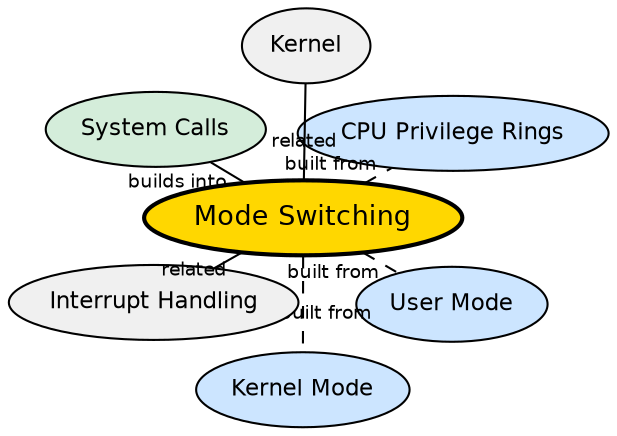

## Formal Definition

"Mode switching is the transition between user mode and kernel mode that occurs when a system call, interrupt, or exception requires privileged execution."

## Explanation

Mode switching is the mechanism by which the CPU changes its privilege level between user mode (restricted) and kernel mode (full access). This is not the same as a process context switch (switching between processes) — it is a change in the CPU's privilege level within the same process. Every system call, hardware interrupt, or CPU exception triggers a mode switch. Because mode switches involve saving and restoring CPU registers, flushing the TLB on some architectures, and privilege validation, they are significantly more expensive than regular function calls. Experienced OS engineers and systems programmers minimize mode switches for performance-critical code.

## How It Works

- A user-mode program executes a special instruction: `syscall` (x86-64), `svc` (ARM), or `int 0x80` (legacy x86)
- The CPU saves the current user-mode state (instruction pointer, stack pointer, registers) to kernel stack
- The CPU loads the kernel's stack and instruction pointer, and sets the mode bit to kernel mode
- The kernel's system call handler executes the requested operation
- Upon completion, the kernel executes a return-from-interrupt instruction (`iret`, `sysret`)
- The CPU restores the user-mode state, sets the mode bit back to user mode, and the program continues
- Interrupts and exceptions follow a similar flow but are triggered by hardware or CPU faults rather than program instructions

## Visual Explanation

```dot
digraph mode_switch {
  rankdir=LR
  node [shape=box style=filled fillcolor="#f0f4ff" fontname="Helvetica"]

  UM [label="User Mode\n(App running)" fillcolor="#cce5ff"]
  TRAP [label="syscall / interrupt"]
  KERN [label="Kernel Mode\n(Handler runs)" fillcolor="#ffd700"]
  RET [label="return"]
  UM2 [label="User Mode\n(App continues)" fillcolor="#cce5ff"]

  UM -> TRAP [label="event occurs"]
  TRAP -> KERN [label="CPU saves state\nmode bit = 0"]
  KERN -> RET [label="operation complete"]
  RET -> UM2 [label="CPU restores state\nmode bit = 1"]
}
```

## Semantic Network

## Key Properties

- Different from a process context switch — mode switch changes privilege level within the same process
- Triggered by system calls, hardware interrupts, and CPU exceptions
- Involves saving/restoring CPU registers and switching stacks
- More expensive (~50-200 CPU cycles) than a regular function call (~5-10 cycles)
- Mode switching overhead is a key reason buffered I/O exists (amortize switch cost over large reads/writes)

## Connections

- Built from: [[user-mode|User Mode]] — mode switching starts in user mode before transitioning to kernel mode
- Built from: [[kernel-mode|Kernel Mode]] — mode switching transitions into kernel mode for privileged work
- Built from: [[cpu-privilege-rings|CPU Privilege Rings]] — the hardware privilege ring mechanism enables mode switching
- Builds into: [[system-calls|System Calls]] — every system call requires a mode switch
- Related: [[kernel|Kernel]] — the kernel orchestrates mode switches through its handler routines
- Related: [[monolithic-kernel|Monolithic Kernel]] — fewer mode switches needed when kernel services are in-kernel vs user-space

## Edge Cases & Gotchas

- Mode switch is NOT the same as context switch — a context switch changes which process runs; a mode switch changes privilege level within the same process
- Too many mode switches degrade performance — this is why `read(fd, buf, 4096)` is better than 4096 calls to `read(fd, byte, 1)`
- Some kernel bypass techniques (DPDK, io_uring) reduce mode switches by allowing user-space to directly interact with hardware in controlled ways
- Virtual machines add another layer: VM exits cause a switch from guest kernel mode to host hypervisor mode

## Sources

- [[os-summary|OS Source Summary]]
