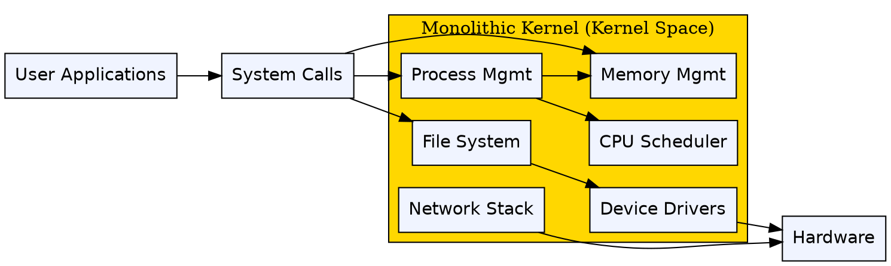
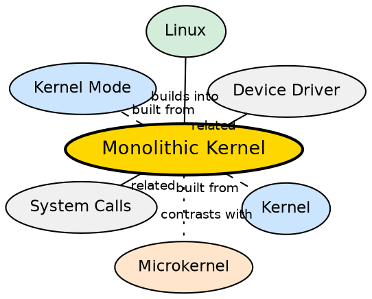

## Formal Definition

"A Monolithic Kernel is a type of operating system architecture in which all operating system services execute in kernel space."

"In a monolithic kernel, all basic services such as process management, memory management, file management, and device drivers run in a single kernel address space."

## Explanation

A monolithic kernel is the traditional and most common kernel architecture. Every OS service — process scheduler, memory manager, file system, device drivers, network stack, interrupt handler — runs in a single giant block of code in kernel mode. Because all components share the same address space, they communicate directly via function calls with no overhead. This makes monolithic kernels very fast. Linux is the most famous example. The tradeoff is that any bug in any kernel component — even a third-party device driver — can crash the entire operating system, since all code runs with full hardware privileges.

## How It Works

- All kernel services are compiled into one large binary that runs in kernel space (Ring 0)
- Components communicate by direct function calls — the file system calls the memory manager's function directly
- No message passing or IPC is needed between kernel services because they all share the same address space
- Device drivers are loaded into kernel space, either compiled in or as dynamically loadable kernel modules (LKMs)
- When an application makes a system call, the kernel handles it entirely within kernel space, often without switching back to user mode until the full operation completes
- Modular monolithic kernels (like Linux) allow loading/unloading modules at runtime, providing some of the flexibility of microkernels without the IPC overhead

## Visual Explanation

## Semantic Network

## Key Properties

- All OS services run in kernel space — no separation between components
- Very fast due to direct function calls (no IPC overhead between services)
- Large codebase — millions of lines of code running with full privileges
- High risk: a bug in any single component can crash the entire system
- Linux is the most prominent example of a monolithic kernel (with modular extensions)
- Dynamic loadable modules (LKMs) provide some flexibility — drivers can be loaded/unloaded at runtime

## Connections

- Built from: [[kernel|Kernel]] — the monolithic kernel is one architectural pattern for kernel design
- Built from: [[kernel-mode|Kernel Mode]] — all monolithic kernel services execute in kernel mode
- Contrasts with: [[microkernel|Microkernel]] — microkernel keeps only essential services in kernel mode, moving others to user space
- Builds into: [[operating-system|Operating System]] — Linux (monolithic kernel) is a complete OS
- Related: [[system-calls|System Calls]] — system calls from applications enter the monolithic kernel
- Related: [[device-management|Device Management]] — device drivers run inside the monolithic kernel space

## Edge Cases & Gotchas

- Modern Linux is not a "pure" monolithic kernel — it supports loadable kernel modules, which is a hybrid feature
- The line between monolithic and microkernel is blurry: Linux can load/unload drivers dynamically, while some microkernels allow loading kernel extensions
- Monolithic kernels are NOT inherently less secure — the attack surface is larger, but the code has been battle-tested for decades (Linux)
- Windows NT uses a hybrid kernel — some services run in kernel mode, some in user mode — occupying a middle ground