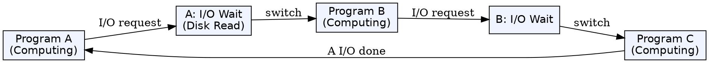
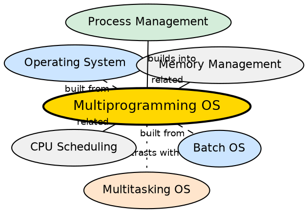

## Formal Definition

"Multiprogramming Operating System is an OS in which multiple programs are kept in memory simultaneously and CPU switches among them to maximize utilization."

## Explanation

Multiprogramming was a breakthrough OS concept designed to solve a critical inefficiency: when a program waits for I/O (disk read, keyboard input), the CPU sits idle. Multiprogramming keeps multiple programs in memory at once. When the currently executing program makes an I/O request, the OS switches the CPU to another program instead of idling. This dramatically improves CPU utilization. The key insight is that most programs spend a significant portion of their time waiting for I/O — by overlapping one program's computation with another program's I/O wait, the CPU stays busy much longer. Multiprogramming is NOT the same as multitasking: the goal is CPU utilization, not user interactivity.

## How It Works

- Multiple programs are loaded into memory simultaneously (e.g., Program A, B, C)
- Program A runs on the CPU until it issues an I/O request (e.g., read from disk)
- Instead of waiting idle, the OS performs a context switch: saves A's state and loads B's state
- Program B runs until it also needs I/O or its time quantum expires (in preemptive variants)
- The OS switches to Program C, and eventually back to A when A's I/O completes
- The degree of multiprogramming (how many programs are in memory) determines how well the CPU can be kept busy
- Memory management (partitioning or paging) must protect each program's memory from interference

## Visual Explanation

## Semantic Network

## Key Properties

- Multiple programs reside in memory simultaneously — only one executes at a time
- Goal: maximize CPU utilization by overlapping computation with I/O wait
- Requires memory protection to isolate programs from each other
- Requires a CPU scheduler to decide which program runs next
- Degree of multiprogramming = number of programs in memory
- Context switching between programs adds overhead but the utilization gain outweighs it

## Connections

- Built from: [[operating-system|Operating System]] — multiprogramming is an OS design concept
- Built from: [[batch-operating-system|Batch Operating System]] — evolved from batch processing by adding concurrent memory residency
- Builds into: [[multitasking-operating-system|Multitasking Operating System]] — multitasking extends multiprogramming with time-sharing for interactivity
- Related: [[process-management|Process Management]] — scheduling and context switching are core enablers of multiprogramming
- Related: [[memory-management|Memory Management]] — keeping multiple programs in memory requires memory partitioning/protection
- Contrasts with: [[real-time-operating-system|Real-Time Operating System]] — RTOS prioritizes timing guarantees over utilization

## Edge Cases & Gotchas

- Too many programs in memory (high degree of multiprogramming) can cause thrashing — the system spends more time swapping than computing
- Without memory protection, one program could corrupt another program's memory — this was a real problem in early systems
- Multiprogramming assumes I/O wait dominates execution time — CPU-bound workloads (pure computation, no I/O) get less benefit
- Students often confuse multiprogramming with multitasking: multiprogramming maximizes CPU utilization; multitasking provides responsive user experience