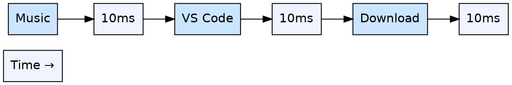
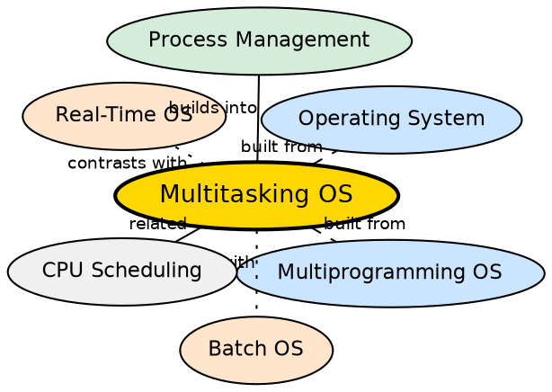

## Formal Definition

"Multitasking Operating System allows multiple tasks to execute seemingly simultaneously by rapidly switching CPU among them."

## Explanation

Multitasking (also called time-sharing) is what makes modern computing feel responsive. When you listen to music, code in VS Code, and download a file simultaneously, the OS is rapidly switching the CPU between these tasks — typically every 10-100 milliseconds. Each task gets a brief "time slice" (quantum), and the switching happens so fast that humans perceive everything running at once. While multiprogramming focuses on maximizing CPU utilization, multitasking focuses on user experience: each active task gets regular CPU time, ensuring no task is starved and the system feels responsive. Modern OSes like Windows, macOS, and Linux are all multitasking systems.

## How It Works

- The OS scheduler maintains a list of all ready tasks (processes or threads)
- Each task is assigned a time quantum (typically 10-100 ms on consumer OSes)
- The scheduler dispatches Task A for its quantum
- A timer interrupt fires when the quantum expires, triggering a context switch
- The scheduler saves Task A's state and loads Task B's state (registers, stack, PC)
- Task B runs for its quantum, then Task C, and so on — round-robin style
- Interactive tasks (keyboard input, UI updates) get priority boosts so they feel snappy
- If a task blocks on I/O, it yields the CPU early — the scheduler picks another ready task

## Visual Explanation

## Semantic Network

## Key Properties

- CPU time is divided into small quanta (10-100 ms) and shared among tasks
- Goal: responsive user experience, not just CPU utilization
- Preemptive scheduling: the OS (not the program) controls when to switch
- Timer interrupt enforces the time quantum — prevents any single task from monopolizing the CPU
- Interactive tasks (UI, input) can be given priority for snappy response
- Underlies all modern general-purpose OSes (Windows, macOS, Linux, Android, iOS)

## Connections

- Built from: [[operating-system|Operating System]] — multitasking is a key feature of modern OSes
- Built from: [[multiprogramming-operating-system|Multiprogramming Operating System]] — multitasking extends multiprogramming with time-sharing and preemption
- Builds into: [[process-management|Process Management]] — the scheduler implements multitasking via context switching and time quanta
- Contrasts with: [[batch-operating-system|Batch Operating System]] — batch OS has no interactivity; multitasking is built for interactive use
- Contrasts with: [[real-time-operating-system|Real-Time Operating System]] — RTOS guarantees deadlines; multitasking guarantees fairness and responsiveness
- Related: [[mode-switching|Mode Switching]] — timer interrupts trigger mode switches for scheduler decisions

## Edge Cases & Gotchas

- Too many active tasks degrade performance — the scheduler overhead of frequent context switching adds up
- CPU-bound tasks can starve I/O-bound tasks if not properly prioritized — modern schedulers use multi-level feedback queues to balance this
- Multitasking does NOT mean parallel execution on a single core — it is rapid interleaving; true parallelism requires multiple cores
- The illusion of simultaneity breaks under heavy load — the system becomes sluggish (high load average)

## Sources

- [[os-summary|OS Source Summary]]
