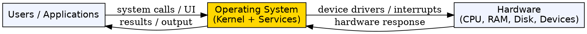
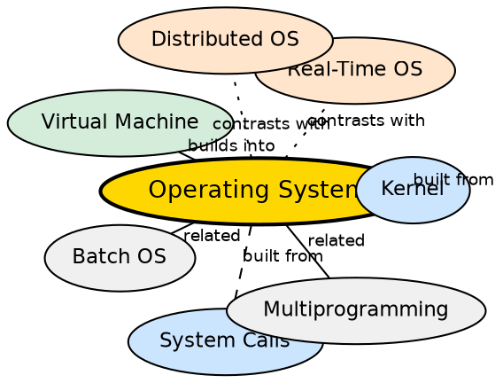

## Formal Definition

"An Operating System is system software that acts as an intermediary between the user and computer hardware and manages system resources while providing services to application programs."

"Operating System is a program that manages computer hardware and software resources and provides common services for computer programs."

## Explanation

An Operating System is the master manager of a computer. Without it, hardware is inert — a CPU cannot run programs, RAM has no allocator, disks have no filesystem. The OS abstracts raw hardware into usable abstractions: processes, files, sockets, virtual memory. It sits between the user/application layer and the physical hardware, translating high-level requests (open a file, send a packet) into low-level hardware operations. The OS enforces security, fairness, and stability so that multiple programs can coexist without interfering with each other.

## How It Works

- The OS boots when the computer starts: BIOS/UEFI loads the bootloader, which loads the OS kernel into memory
- The kernel initializes hardware (CPU, memory, devices) and sets up core data structures (process table, memory map, file descriptors)
- The OS presents a user interface — CLI or GUI — through which users launch applications
- Each application runs as a process, and the OS scheduler decides which process gets CPU time
- When an application needs hardware resources, it issues a system call, which switches the CPU from user mode to kernel mode
- The OS maintains isolation between processes: each process gets its own virtual address space, and the OS prevents cross-process memory access
- The OS also provides a file system abstraction over raw disk blocks, a networking stack, and device drivers for peripherals

## Visual Explanation

## Semantic Network

## Key Properties

- Acts as an intermediary between user programs and hardware
- Manages CPU, memory, storage, and device resources
- Provides process isolation and security boundaries
- Supports multiple users and concurrent program execution
- Abstracts hardware complexity through standardized APIs (system calls)
- Enforces fair resource allocation via scheduling algorithms

## Connections

- Built from: [[kernel|Kernel]] — the core component of every OS
- Built from: [[system-calls|System Calls]] — the interface through which programs request OS services
- Builds into: [[virtual-machine|Virtual Machine]] — VMs run on top of a host OS
- Contrasts with: [[real-time-operating-system|Real-Time Operating System]] — RTOS prioritizes timing guarantees over general-purpose throughput
- Related: [[batch-operating-system|Batch Operating System]] — an early OS type that processes jobs in groups
- Related: [[multiprogramming-operating-system|Multiprogramming Operating System]] — keeps multiple programs in memory to maximize CPU utilization

## Edge Cases & Gotchas

- The kernel is NOT the same as the OS: the OS includes the kernel plus utilities, UI, libraries, and file system components
- An OS can be running but appear frozen if the GUI hangs — the kernel may still be functioning
- Embedded systems often run without a full OS (bare-metal) or with a lightweight RTOS, not a general-purpose OS
- Containerized environments share the host OS kernel — this is fundamentally different from VMs which each have their own OS