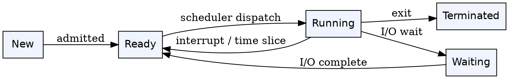
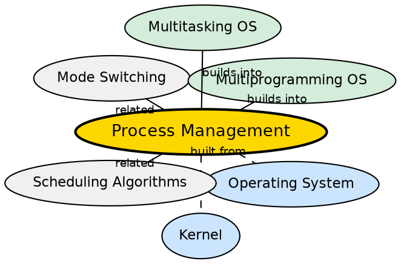

## Formal Definition

"Process Management is the function of an operating system that handles the creation, scheduling, execution, and termination of processes."

## Explanation

Process management is the OS function responsible for juggling multiple programs on a single CPU. Since a CPU can execute only one instruction stream at a time (on a single core), the OS must decide which process runs now, for how long, and what happens when it pauses (e.g., waiting for disk I/O). This is called CPU scheduling. The OS also manages the full lifecycle of a process: creation (when a program starts), ready state (waiting for CPU), running state (executing), waiting state (blocked on I/O), and termination. Without process management, one program could hog the CPU forever, and multitasking would be impossible.

## How It Works

- When a program is launched, the OS creates a process: allocates a Process Control Block (PCB), assigns a PID, and sets up address space
- The process enters the ready queue, waiting for the CPU scheduler to pick it
- The scheduler uses an algorithm (FCFS, Round Robin, Priority, SJF) to decide which ready process gets CPU time
- The scheduler performs a context switch: saves the current process's state (registers, PC, stack) and loads the next process's state
- If a process makes a blocking I/O call (e.g., read from disk), it enters the waiting state; the scheduler picks another ready process
- When I/O completes, the process returns to ready queue
- The process eventually terminates (normal exit, error, or killed by signal) — the OS frees its resources

## Visual Explanation

## Semantic Network

## Key Properties

- Manages the full process lifecycle: create, ready, run, wait, terminate
- Uses a Process Control Block (PCB) per process to store state (registers, PID, memory info, open files)
- CPU scheduling algorithms determine which process runs and for how long
- Context switching between processes is expensive (TLB flush, register save/restore)
- Multiprogramming relies on process management to keep the CPU busy during I/O waits

## Connections

- Built from: [[kernel|Kernel]] — the kernel's scheduler implements process management
- Built from: [[operating-system|Operating System]] — process management is a core OS function
- Builds into: [[multiprogramming-operating-system|Multiprogramming Operating System]] — process management enables multiple programs in memory
- Builds into: [[multitasking-operating-system|Multitasking Operating System]] — process management enables rapid switching for user-facing tasks
- Related: [[mode-switching|Mode Switching]] — context switches are different from mode switches but both involve the scheduler
- Related: [[inter-process-communication|Inter-Process Communication]] — IPC allows processes to communicate and synchronize

## Edge Cases & Gotchas

- Context switch is NOT the same as mode switch — context switch changes the running process (saves/loads PCB); mode switch changes privilege level within the same process
- Infinite loops in user mode can be preempted by timer interrupts — the scheduler reclaims control
- Priority inversion can occur when a high-priority process waits for a resource held by a low-priority process (solved by priority inheritance)
- Zombie processes (terminated but not waited on by parent) and orphan processes (parent terminated before child) are edge cases the OS must handle

## Sources

- [[os-summary|OS Source Summary]]
