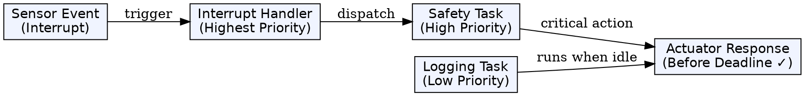
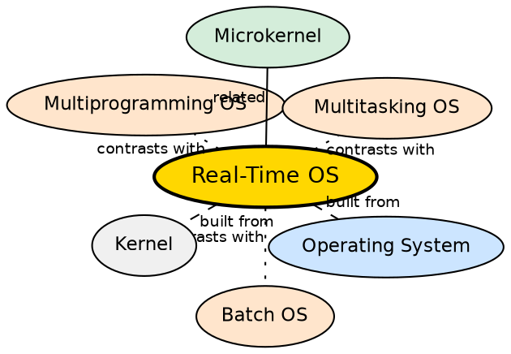

## Formal Definition

"A Real-Time Operating System is an operating system that guarantees response within a specified time constraint."

## Explanation

An RTOS is designed for systems where timing is not just important — it is critical. Unlike a general-purpose OS that tries to be "fair" to all tasks, an RTOS guarantees that a specific operation will complete within a deadline. In a car's airbag system, the sensor reading must trigger deployment within milliseconds — a late response means injury or death. RTOS achieves this through deterministic scheduling: tasks have fixed priorities, and the highest-priority ready task always runs. There are two variants: hard real-time (deadline must never be missed — aerospace, medical) and soft real-time (occasional missed deadline is acceptable — video streaming, gaming). RTOSes are typically smaller and more predictable than general-purpose OSes.

## How It Works

- The RTOS uses priority-based preemptive scheduling — the highest-priority ready task always gets the CPU
- Tasks are assigned fixed priorities during system design; critical tasks get the highest priority
- The OS does not use time-sharing (fairness) — a high-priority task runs until it completes or blocks
- Interrupts are handled with minimal latency — the interrupt handler runs immediately, then awakens the relevant high-priority task
- The scheduler is deterministic — the maximum time to execute any scheduling operation is bounded and known
- Resource sharing uses priority inheritance to avoid priority inversion (low-priority task holding a lock needed by a high-priority task)
- The OS kernel is often minimal — many RTOSes are microkernels or even just a scheduler + IPC

## Visual Explanation

## Semantic Network

## Key Properties

- Guaranteed response within a specified deadline — determinism is the key requirement
- Hard real-time: missing a deadline is a system failure (aircraft, medical, automotive)
- Soft real-time: occasional missed deadlines degrade quality but don't fail the system (video, audio)
- Priority-based preemptive scheduling with fixed priorities
- Minimal interrupt latency and dispatch latency
- Small kernel footprint — often a few KB of code
- Used in embedded systems, industrial control, automotive, aerospace, medical devices

## Connections

- Built from: [[operating-system|Operating System]] — RTOS is a specialized type of OS
- Built from: [[kernel|Kernel]] — the RTOS kernel is designed for minimal latency and deterministic scheduling
- Contrasts with: [[batch-operating-system|Batch Operating System]] — batch OS has no timing consideration; RTOS is built around timing guarantees
- Contrasts with: [[multitasking-operating-system|Multitasking Operating System]] — multitasking aims for fairness; RTOS aims for deadline predictability
- Contrasts with: [[multiprogramming-operating-system|Multiprogramming Operating System]] — focuses on utilization, not timing
- Related: [[microkernel|Microkernel]] — many RTOSes use microkernel design for reliability (e.g., QNX)

## Edge Cases & Gotchas

- Priority inversion (a high-priority task blocked by a low-priority task holding a lock) can cause deadline misses — solved by priority inheritance
- Interrupt storms (too many interrupts in a short period) can cause all high-priority tasks to be I/O bound, starving computation
- An RTOS does NOT mean "very fast" — it means "predictably timed" — a general-purpose OS can have higher average throughput
- Hard real-time requires end-to-end analysis: sensor → processing → actuator, not just the scheduler
- Linux with PREEMPT_RT is a soft real-time variant — it is not a hard RTOS

## Sources

- [[os-summary|OS Source Summary]]
