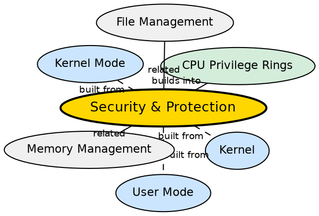

## Formal Definition

"Security and Protection in an operating system refers to the mechanisms that control access to system resources, prevent unauthorized use, and protect processes from interfering with each other."

## Explanation

Security and protection are fundamental responsibilities of any OS. Protection ensures that one process cannot accidentally or maliciously interfere with another process's memory, files, or execution. Security extends this to defend against external threats (malware, unauthorized access). The OS enforces these through multiple layers: hardware (CPU privilege rings, MMU page protection), kernel-enforced checks (system call validation, file permissions), and authentication mechanisms (user accounts, passwords, access control lists). Without this, every program would have unrestricted access to all memory, files, and hardware — a recipe for chaos and catastrophic data loss.

## How It Works

- Hardware-level protection: CPU privilege rings prevent user-mode programs from executing privileged instructions; the MMU prevents a process from accessing memory outside its allocated pages
- System call validation: the kernel checks every system call's arguments — are the pointers valid? does the process have permission?
- File permissions: each file has an owner and permission bits (read/write/execute for user/group/others) checked on every open
- Memory protection: each process has an isolated virtual address space; page table entries include permission bits (read, write, execute)
- User authentication: login credentials (password, SSH key, biometric) establish user identity
- Access control: Discretionary Access Control (DAC) in Unix/Linux; Mandatory Access Control (MAC) in SELinux/AppArmor
- Audit logging: security-relevant events are recorded for later analysis

## Visual Explanation

```dot
digraph security_protection {
  rankdir=LR
  node [shape=box style=filled fillcolor="#f0f4ff" fontname="Helvetica"]

  USER [label="User / Process"]
  AUTH [label="Authentication\n(Password / Key / Biometric)"]
  ACCESS [label="Access Control\n(File Permissions / ACLs)"]
  KERN [label="Kernel Checks\n(System Call Validation)" fillcolor="#ffd700"]
  HW [label="Hardware Enforced\n(Privilege Rings / MMU)"]
  RES [label="Resource\n(Memory / File / Device)"]

  USER -> AUTH
  AUTH -> ACCESS
  ACCESS -> KERN
  KERN -> HW
  HW -> RES
}
```

## Semantic Network

## Key Properties

- Multi-layered: hardware + kernel + OS policies working together
- Memory protection prevents process-to-process interference via page-level permissions
- File permissions (owner/group/other, read/write/execute) control data access
- System call validation ensures user programs cannot trick the kernel into unsafe operations
- User authentication establishes identity; access control lists (ACLs) provide fine-grained permissions
- Protection is mandatory — enforced by hardware/software; security is policy-driven and configurable

## Connections

- Built from: [[kernel|Kernel]] — the kernel enforces all security checks and mediates access
- Built from: [[user-mode|User Mode]] — user-mode restrictions are the foundation of protection
- Built from: [[cpu-privilege-rings|CPU Privilege Rings]] — ring-based protection is the lowest-level security mechanism
- Builds into: [[file-management|File Management]] — file permissions are a key security mechanism
- Builds into: [[memory-management|Memory Management]] — memory protection and address space isolation
- Related: [[kernel-mode|Kernel Mode]] — only kernel-mode code can override security policies

## Edge Cases & Gotchas

- A buffer overflow in a privileged process can bypass OS security — even if the kernel is secure, vulnerable user-space daemons (running as root) are weak points
- TOCTOU (Time of Check to Time of Use) races can subvert permission checks — a file permission is checked, then the file is replaced before use
- Side-channel attacks (Spectre, Meltdown) exploit CPU speculation to read protected kernel memory — hardware-level protection was insufficient against these
- Zero-day vulnerabilities in the kernel itself bypass all OS security layers — defense-in-depth (SELinux, sandboxing, containerization) mitigates the blast radius

## Sources

- [[os-summary|OS Source Summary]]
