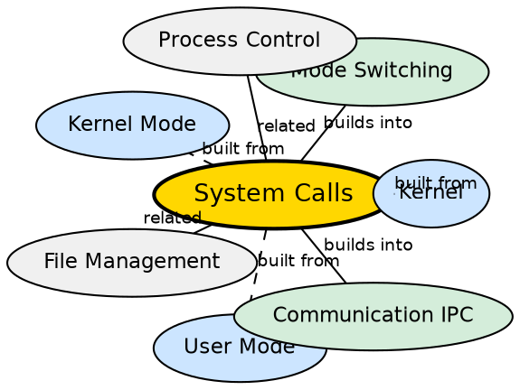

## Formal Definition

"A system call is a mechanism through which a user program requests a service from the operating system kernel."

"System calls provide an interface between a process and the operating system."

## Explanation

System calls are the only legal way for user-space programs to get privileged work done. When a Python script calls `open("file.txt")`, that innocent-looking line triggers a chain: the standard library invokes a system call, the CPU switches from user mode to kernel mode, and the kernel performs the actual file read. System calls exist because applications cannot be trusted with direct hardware access — a malicious or buggy program could corrupt memory, steal data, or crash the system. The syscall interface enforces a controlled gateway: the kernel validates every request before executing it.

## How It Works

- A user program calls a library function (e.g., `read()` in C, `open()` in Python)
- The library function places arguments in CPU registers and triggers a software interrupt or a special `syscall` instruction
- The CPU switches from user mode to kernel mode (mode switch)
- The kernel's system call handler looks up the requested operation in a syscall table
- The kernel validates arguments (checking pointers, permissions) and performs the operation
- Results are placed in registers, the CPU switches back to user mode, and control returns to the application
- Categories of system calls include: process control (`fork`, `exec`, `exit`), file management (`open`, `read`, `write`, `close`), device management (`ioctl`), information maintenance (`gettimeofday`), and communication (`socket`, `send`, `recv`)

## Visual Explanation

```dot
digraph system_call {
  rankdir=LR
  node [shape=box style=filled fillcolor="#f0f4ff" fontname="Helvetica"]

  APP [label="Application\n(User Mode)"]
  LIBC [label="libc Wrapper"]
  SYS [label="syscall Instruction"]
  KERN [label="Kernel Handler\n(Kernel Mode)" fillcolor="#ffd700"]
  RESULT [label="Return to User Mode"]

  APP -> LIBC [label="open(\"f.txt\")"]
  LIBC -> SYS [label="set args + trap"]
  SYS -> KERN [label="mode switch"]
  KERN -> RESULT [label="complete + return"]
}
```

## Semantic Network

## Key Properties

- Enables user-space programs to request kernel services
- Triggers a mode switch from user mode to kernel mode
- Categorized into process control, file management, device management, information maintenance, and communication
- System calls are more expensive than normal function calls due to mode switching overhead
- Experienced programmers batch operations (read large chunks) rather than making many small syscalls

## Connections

- Built from: [[kernel|Kernel]] — the kernel implements and handles system calls
- Built from: [[user-mode|User Mode]] — programs must exit user mode via syscalls to perform privileged work
- Built from: [[kernel-mode|Kernel Mode]] — the syscall handler executes in kernel mode
- Builds into: [[mode-switching|Mode Switching]] — each system call causes a user-to-kernel mode switch
- Contrasts with: function calls — function calls stay in user mode and have no hardware access; system calls switch to kernel mode
- Related: [[inter-process-communication|Inter-Process Communication]] — IPC often relies on communication-related system calls

## Edge Cases & Gotchas

- System calls are NOT the same as library functions — `printf()` is a library function that internally calls `write()` syscall
- Too many small system calls kills performance: reading a file one byte at a time causes a syscall per byte, while buffered reading uses one syscall per buffer
- Some system calls block (e.g., `read` from a socket with no data) — the process is suspended until data arrives
- Students often confuse function call (user mode only) with system call (requires kernel mode switch) — the key distinction is privilege escalation

## Sources

- [[os-summary|OS Source Summary]]
