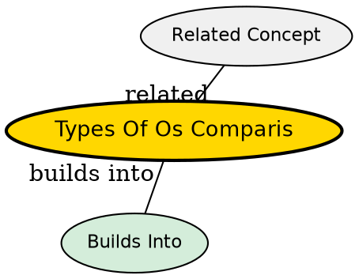

## Framing

This synthesis compares the five major types of operating systems discussed in the source: Batch OS, Multiprogramming OS, Multitasking OS, Real-Time OS (RTOS), and Distributed OS. Each type emerged from a specific problem: batch processing addressed expensive hardware underutilization; multiprogramming solved CPU idle time during I/O; multitasking made computers responsive for interactive users; RTOS added timing guarantees for safety-critical systems; and distributed OS scaled computation across multiple machines.

## Structured Comparison

| Dimension | Batch OS | Multiprogramming | Multitasking | RTOS | Distributed OS |
|---|---|---|---|---|---|
| **Primary goal** | Throughput | CPU utilization | User responsiveness | Deadline predictability | Resource aggregation |
| **Interactivity** | None | Low | High | Depends on task | Transparent |
| **CPU sharing** | Sequential | Overlap I/O wait | Time slicing | Priority-based | Across nodes |
| **Timing guarantee** | None | None | None | Hard/Soft | None |
| **Number of machines** | 1 | 1 | 1 | 1 | Many |
| **Example** | Early punch-card systems | IBM OS/360 | Windows, Linux, macOS | QNX, VxWorks | Plan 9, Amoeba |
| **Key challenge** | Job scheduling | Memory protection | Fair scheduling | Determinism | Consistency |
| **Era introduced** | 1950s | 1960s | 1970s | 1970s | 1980s |

## Insights Beyond Individual Concepts

### Evolution, Not Replacement

These OS types did not replace each other -- they layered on top. Modern Linux combines multiprogramming (keeping many processes in memory), multitasking (time-sharing the CPU), and soft real-time capabilities (via PREEMPT_RT). Batch processing survives in HPC schedulers (SLURM, PBS). Distributed OS concepts live on in cluster orchestration (Kubernetes, Mesos). Each type specialized in a problem that prior types did not solve well.

### The Tradeoff Triangle

OS types represent different points on a triangle of competing goals: **Throughput** (batch), **Responsiveness** (multitasking), and **Predictability** (RTOS). No single OS type maximizes all three. Multiprogramming sits between batch and multitasking -- improving utilization over batch but not as responsive as true multitasking.

### Distributed as a Meta-Type

Distributed OS is orthogonal to the other types in a sense -- you could have a distributed batch system, a distributed multitasking system, etc. The distribution dimension adds complexity (network coordination, partial failure, consistency) on top of the chosen OS type's challenges.

## Visual Explanation

## Semantic Network

## Connections

- [[batch-operating-system|Batch Operating System]] -- processes jobs in groups, no interactivity
- [[multiprogramming-operating-system|Multiprogramming Operating System]] -- keeps multiple programs in memory to keep CPU busy
- [[multitasking-operating-system|Multitasking Operating System]] -- time-sharing CPU for responsive user experience
- [[real-time-operating-system|Real-Time Operating System]] -- guarantees timing constraints
- [[distributed-operating-system|Distributed Operating System]] -- multiple computers as one system
- [[operating-system|Operating System]] -- all types are variants of an OS
- [[process-management|Process Management]] -- scheduling varies significantly across OS types
- [[memory-management|Memory Management]] -- multiprogramming requires memory protection between in-memory programs