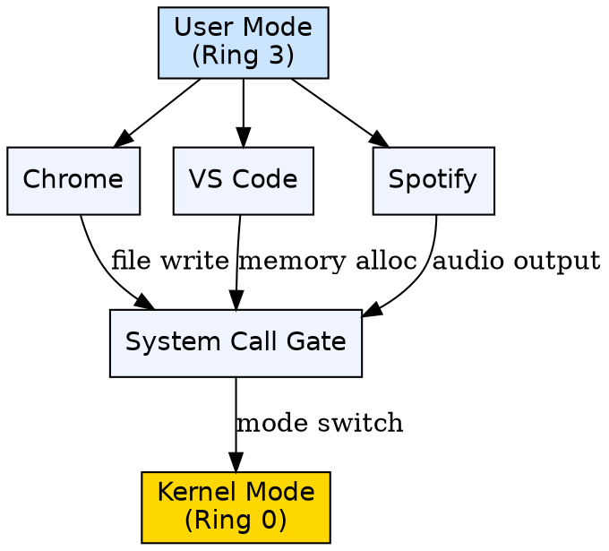
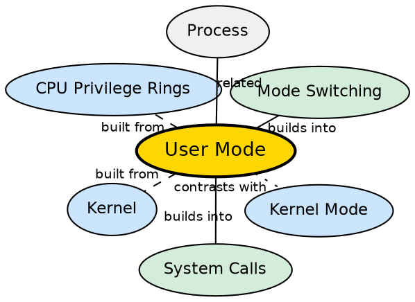

## Formal Definition

"User mode is the execution mode in which user applications run with limited privileges and cannot directly access hardware or critical system resources."

## Explanation

User mode is the restricted operating mode where all normal applications execute. Think of it as the "citizen" level of privilege: applications in user mode cannot execute privileged CPU instructions, cannot directly access hardware, cannot read or write kernel memory, and cannot access another process's memory space. This is a deliberate design — it prevents a buggy calculator app from crashing the OS or a malicious program from stealing passwords. When an application needs something it cannot do in user mode, it must request the kernel via a system call, which triggers a mode switch.

## How It Works

- The CPU maintains a mode bit (0 for kernel mode, 1 for user mode) in a control register
- When the OS creates a process, it sets the mode bit to user mode before transferring control to the application
- The application runs normally until it attempts a privileged operation (e.g., accessing hardware, executing a privileged instruction like HLT or setting interrupt vectors)
- If a user-mode program attempts a privileged instruction, the CPU raises a trap/general protection fault, and the kernel takes over
- The only way to escape user mode is through a system call — a deliberate, controlled entry point
- Most of the operating system's code (shell, compiler, GUI, system utilities) actually runs in user mode, not kernel mode

## Visual Explanation

## Semantic Network

## Key Properties

- Applications run with restricted privileges — no direct hardware access, no privileged CPU instructions
- Memory access is limited to the process's own virtual address space
- A trap occurs if any privileged instruction is attempted from user mode
- The only escape to kernel mode is through well-defined system call entry points
- Most OS components (shell, compiler, GUI) run in user mode—only the kernel runs in kernel mode

## Connections

- Built from: [[kernel|Kernel]] — the kernel enforces user-mode restrictions via the CPU privilege level
- Built from: [[cpu-privilege-rings|CPU Privilege Rings]] — user mode corresponds to Ring 3 in the x86 protection ring model
- Contrasts with: [[kernel-mode|Kernel Mode]] — kernel mode has full privileges, user mode has restricted privileges
- Builds into: [[mode-switching|Mode Switching]] — transitioning from user mode to kernel mode is fundamental mode switching
- Builds into: [[system-calls|System Calls]] — system calls are the mechanism to escape user mode
- Related: [[process-management|Process Management]] — each process executes in user mode except during syscalls

## Edge Cases & Gotchas

- The GUI and terminal run in user mode, not kernel mode — a common misconception
- User mode programs CAN crash without taking down the OS — this is the whole point of the separation
- Some CPU architectures have more than two privilege levels (e.g., x86 has 4 rings) but most OSes use only Ring 0 and Ring 3
- Modern browsers use sandboxing to further restrict user-mode processes, creating additional security layers

## Sources

- [[os-summary|OS Source Summary]]
