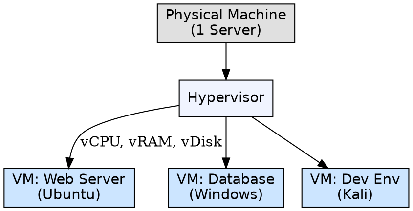
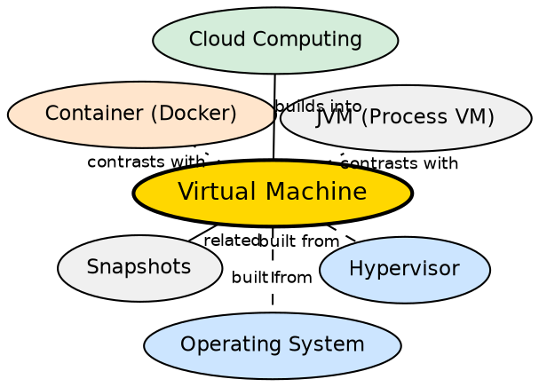

## Formal Definition

"A Virtual Machine (VM) is a software emulation of a physical computer system that provides the functionality of a real computer."

"A virtual machine is an isolated execution environment created by virtualization software, allowing multiple operating systems to run on the same physical hardware."

## Explanation

A virtual machine is a "computer inside a computer." It is a software-based simulation of a complete computer system — with virtual CPU, virtual RAM, virtual disk, and virtual network interfaces — that runs as an isolated environment on a physical host. Each VM runs its own operating system (guest OS) that believes it is running on real hardware. This allows one physical machine to host multiple OS environments simultaneously, for purposes like testing, server consolidation, security isolation, and running software that requires a different OS. The key enabler is the hypervisor, which creates, manages, and isolates VMs.

## How It Works

- The hypervisor creates virtual hardware for each VM: virtual CPU cores, virtual RAM, virtual disk (stored as a file), virtual network card, and virtual BIOS
- The guest OS is installed into this virtual hardware — it boots normally, unaware of the virtualization layer
- When the guest OS executes a privileged instruction (e.g., halt CPU, set page tables), the CPU hardware traps the instruction and the hypervisor emulates it
- Hardware-assisted virtualization (Intel VT-x / AMD-V) allows most guest instructions to run directly on the CPU, only trapping privileged ones
- Each VM is isolated: its memory is mapped to separate physical pages; its disk writes go to a separate virtual disk file
- Snapshots capture the entire VM state (memory + disk), allowing rollback to a previous state

## Visual Explanation

## Semantic Network

## Key Properties

- Each VM includes a full guest OS — separate kernel, drivers, and system libraries
- Strong isolation: a crash in one VM does not affect other VMs or the host
- Server consolidation: one physical server can host many VMs, improving hardware utilization
- Snapshot and restore: full machine state can be saved and reverted
- Types: system VMs (full OS) and process VMs (single application, e.g., JVM)
- Performance overhead from virtualization layer — typically 5-20% compared to native

## Connections

- Built from: [[hypervisor|Hypervisor]] — the hypervisor creates and manages VMs
- Built from: [[operating-system|Operating System]] — each VM runs its own guest OS
- Contrasts with: containers — containers share the host OS kernel; VMs each have their own kernel
- Builds into: [[distributed-operating-system|Distributed Operating System]] — VMs are building blocks for cloud and distributed systems
- Related: [[kernel-mode|Kernel Mode]] — VMs introduce an additional privilege level below kernel mode (Ring -1)
- Related: [[monolithic-kernel|Monolithic Kernel]] — the host OS kernel interacts with the hypervisor to support VMs

## Edge Cases & Gotchas

- VM performance overhead varies by workload: CPU-bound work is near-native with hardware virtualization; I/O-bound work loses more to emulation
- Memory overcommitment (allocating more virtual RAM than physical RAM) works but can cause swapping thrashing
- Timekeeping inside VMs can drift — the guest OS reads an emulated timer, not the real hardware clock
- Nested virtualization (running a hypervisor inside a VM) is possible but slow without specific CPU feature support