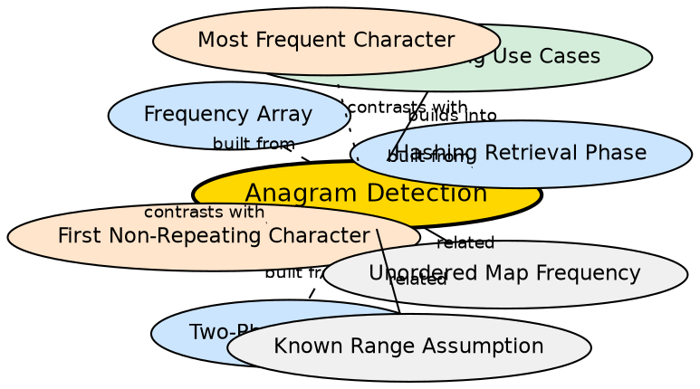

## Formal Definition

Anagram detection determines whether two strings are permutations of each other — that is, whether they contain the same characters with the same frequencies. The hash-based approach builds frequency structures for both strings and compares them. Anagrams produce identical frequency maps.

$$ \text{are\_anagrams}(S_1, S_2) \iff \forall c, \text{freq}_{S_1}(c) = \text{freq}_{S_2}(c) $$

## Explanation

Two strings are anagrams if one can be rearranged to form the other. The simplest correct approach is to count character frequencies for both strings and compare. This elegantly demonstrates the two-phase hashing pattern applied to two inputs simultaneously — Phase 1 runs twice (once per string), then Phase 2 compares the two structures.

## How It Works

1. Build frequency array/map for string 1 (`freq1`)
2. Build frequency array/map for string 2 (`freq2`)
3. **For arrays:** compare element by element — all 26 slots must match
4. **For maps:** compare key-value pairs — all keys in one must exist in the other with the same values
5. If all counts match, the strings are anagrams

## Mathematical Formulation

For strings $S_1$ and $S_2$ over alphabet $\Sigma$:

$$ \text{Anagram}(S_1, S_2) \iff \forall c \in \Sigma, \text{count}(S_1, c) = \text{count}(S_2, c) $$

$$ \text{Anagram}(S_1, S_2) \iff \sum_{c \in \Sigma} |\text{count}(S_1, c) - \text{count}(S_2, c)| = 0 $$

## Visual Explanation

```dot
digraph anagram_detection {
  rankdir=TB
  node [shape=box style=filled fillcolor="#f0f4ff" fontname="Helvetica"]

  S1 [label="String 1:\n'listen'"]
  S2 [label="String 2:\n'silent'"]
  P1_S1 [label="Phase 1\nBuild freq1"]
  P1_S2 [label="Phase 1\nBuild freq2"]
  F1 [label="freq1:\ne:1, i:1, l:1\nn:1, s:1, t:1"]
  F2 [label="freq2:\ne:1, i:1, l:1\nn:1, s:1, t:1"]
  COMPARE [label="Compare\nfreq1 == freq2?" shape=diamond]
  YES [label="Anagram!" fillcolor="#d4edda]
  NO [label="Not Anagram" fillcolor="#ffe5cc"]

  S1 -> P1_S1
  S2 -> P1_S2
  P1_S1 -> F1
  P1_S2 -> F2
  F1 -> COMPARE
  F2 -> COMPARE
  COMPARE -> YES [label="yes"]
  COMPARE -> NO [label="no"]
}
```

## Semantic Network



## Key Properties

- O(n + m) time where n and m are the lengths of the two strings
- O(|Σ|) space for arrays (26 slots), O(k) for maps (k distinct characters in both strings)
- Two structures must be compared — doubles the Phase 1 work
- Early exit possible: if lengths differ, they cannot be anagrams (check before building)
- Sorting both strings and comparing is also correct but O(n log n) — hashing is faster

## Connections

- Built from: [[hashing-retrieval-phase|Hashing Retrieval Phase]] — comparing two structures is a Phase 2 variant
- Built from: [[two-phase-hashing|Two-Phase Hashing Paradigm]] — Phase 1 runs twice, then Phase 2 compares
- Built from: [[frequency-array|Frequency Array]] — arrays are ideal for lowercase-only anagram checks
- Contrasts with: [[most-frequent-character|Most Frequent Character]] — different Phase 2 goal despite same Phase 1
- Contrasts with: [[first-non-repeating-character|First Non-Repeating Character]] — compares structures instead of re-traversing
- Related: [[known-range-assumption|Known Range Assumption]] — for known alphabets, arrays are simpler than maps

## Edge Cases & Gotchas

- Different lengths: immediately return false — no need to build structures
- Empty strings: two empty strings are anagrams (both have zero length and empty frequency maps)
- Case sensitivity: "Listen" and "Silent" are not anagrams by default — convert to same case first if needed
- Unicode characters: arrays cannot handle this — must use hash maps
- Whitespace and punctuation: the problem typically specifies whether to ignore these
- Sorting approach (O(n log n)) is simpler to code but slower — hashing is the interview-optimized answer

## Sources

- [[strings-summary|Strings (Character Hashing in C++)]]
