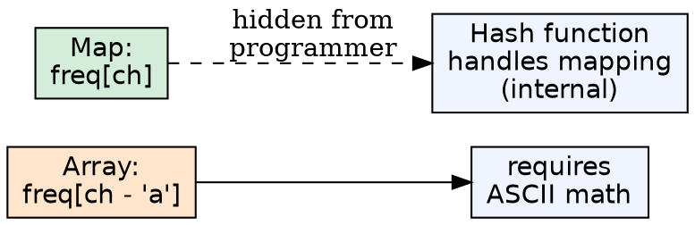
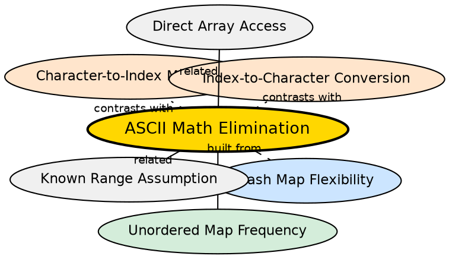

## Formal Definition

ASCII math elimination is the property of hash maps (like `std::unordered_map`) that they accept keys directly without requiring index conversion. Where a frequency array needs `ch - 'a'` to compute an array index, a hash map uses `freq[ch]` directly — the character itself is the key, and the hash function handles the mapping. This eliminates the need for ASCII arithmetic entirely.

## Explanation

With frequency arrays, every character must go through `ch - 'a'` to become an array index. This assumes lowercase ASCII contiguity, breaks for mixed case, and requires a separate reverse conversion (`i + 'a'`) for output. Hash maps bypass all of this: the character is used as-is. The hash function converts it to a bucket index internally, invisible to the programmer. This is the fundamental ergonomic advantage of hash maps over arrays.

## How It Works

1. Declare `unordered_map<char, int> freq` — key type is `char`, value type is `int`
2. To insert: `freq[ch]++` — no conversion needed, the character is the key
3. To query: `freq[ch]` — same direct access
4. Internally, the map calls `std::hash<char>()(ch)` to compute the bucket index
5. The programmer never sees the hash value or bucket index — it is fully abstracted

## Visual Explanation

## Semantic Network

## Key Properties

- Eliminates source of bugs: no more `ch - 'a'` on uppercase characters producing negative indices
- Works for any character type: lowercase, uppercase, digits, punctuation, Unicode
- No reverse conversion needed for output — the key is already the character
- The hash function cost is the tradeoff — internal computation replaces explicit ASCII math
- One less thing to think about during coding interviews — reduces cognitive load

## Connections

- Built from: [[hash-map-flexibility|Hash Map Flexibility]] — the ability to use diverse key types enables this
- Builds into: [[unordered-map-frequency|Unordered Map for Frequency Counting]] — maps use direct keys without conversion
- Contrasts with: [[character-to-index-mapping|Character-to-Index Mapping]] — arrays require explicit conversion; maps eliminate it
- Contrasts with: [[index-to-character-conversion|Index-to-Character Conversion]] — maps don't need the reverse conversion either
- Related: [[known-range-assumption|Known Range Assumption]] — arrays need known ranges; maps eliminate this assumption
- Related: [[direct-array-access|Direct Array Access]] — arrays have no hashing cost but pay in conversion complexity

## Edge Cases & Gotchas

- The hash function is not free — for small domains (26 lowercase letters), the conversion cost of `ch - 'a'` is negligible while the hash function adds measurable overhead
- Deleting the ASCII math does not mean deleting all constraints — the map's hash function must handle the key type correctly (all standard types are supported in C++)
- For custom key types (e.g., structs), a custom hash function must be provided — ASCII math elimination only applies to built-in types
- The elimination is conceptual, not architectural — internally the map still converts the key to an index; it just hides this from the programmer