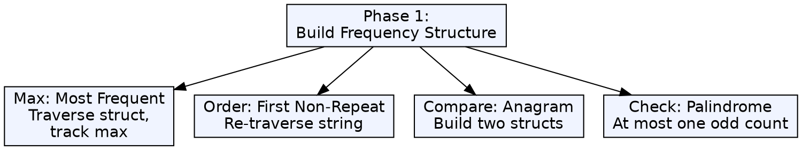
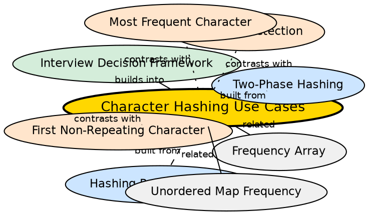

## Formal Definition

Character hashing use cases are the set of string problems solvable by building a frequency structure (Phase 1) and then applying problem-specific retrieval logic (Phase 2). Common patterns include finding the most frequent character, detecting anagrams, finding the first non-repeating character, checking if a string can be rearranged, and validating character-level constraints.

## Explanation

Character hashing is a family of problems, not a single problem. What unifies them is the Phase 1 structure (identical across all problems) and what differentiates them is the Phase 2 retrieval (unique to each problem). Mastering character hashing means recognizing which problems share Phase 1 and knowing how Phase 2 varies.

## How It Works

1. Read the problem: does it involve counting character occurrences?
2. If yes, Phase 1 is mechanical — build the frequency structure
3. Determine the Phase 2 pattern:
   - **Max/Min:** traverse structure, track extreme value
   - **Order-sensitive:** re-traverse the original string
   - **Comparison:** build two structures and compare
   - **Constraint check:** verify counts satisfy a condition (e.g., palindrome rearrangement: at most one odd count)
4. Apply the pattern to the specific problem

## Visual Explanation

## Semantic Network

## Key Properties

- All use cases share Phase 1 — the structure-building code is reusable across problems
- Phase 2 is problem-specific — changing the problem changes only the retrieval logic
- Problems can be categorized by Phase 2 pattern: max/min, order-sensitive, comparison, constraint
- The category determines data structure choice (array vs map may differ by use case)
- Recognition of the pattern is the skill — once Phase 2 is categorized, coding is mechanical

## Connections

- Built from: [[two-phase-hashing|Two-Phase Hashing Paradigm]] — the paradigm defines the structure of all these problems
- Built from: [[hashing-retrieval-phase|Hashing Retrieval Phase]] — each use case is a specific Phase 2 strategy
- Builds into: [[interview-decision-framework|Array vs Hash Map Decision Framework]] — understanding use cases enables choosing the right tool
- Contrasts with: [[most-frequent-character|Most Frequent Character]] — a specific instance of the max/min category
- Contrasts with: [[anagram-detection-via-hashing|Anagram Detection]] — a specific instance of the comparison category
- Contrasts with: [[first-non-repeating-character|First Non-Repeating Character]] — a specific instance of the order-sensitive category

## Edge Cases & Gotchas

- Not all string problems are hashing problems — substring search, pattern matching, and edit distance use different techniques
- Some problems can be solved in one pass (tracking max while building frequencies) — the two-phase model is conceptual, not always sequential
- For palindrome rearrangement: the constraint is "at most one character has odd count" — this Phase 2 check is a simple filter
- For "character that appears more than n/2 times" (majority element): Boyer-Moore voting is more efficient than hashing — recognizing when NOT to hash is also important
- For problems with very large alphabets (Unicode), hashing is necessary but may benefit from specialized data structures (e.g., trie for prefix frequencies)

## Sources

- [[strings-summary|Strings (Character Hashing in C++)]]
