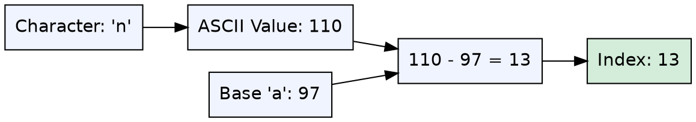
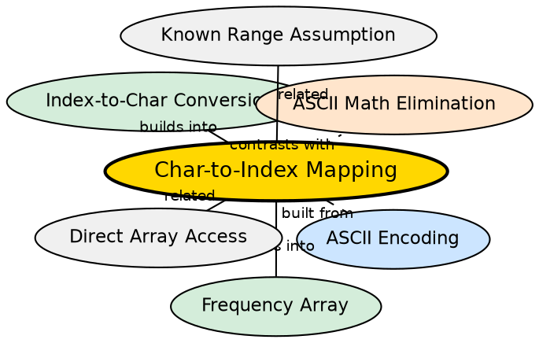

## Formal Definition

Character-to-index mapping is the transformation of a character to an integer index by subtracting the base character's ASCII value. For lowercase English letters, `index = ch - 'a'` maps 'a'→0, 'b'→1, ..., 'z'→25. This enables using characters as array indices.

$$ \text{index}(c) = \text{ASCII}(c) - \text{ASCII}(\text{base}) $$

## Explanation

Computers store characters as integer codes (ASCII, UTF-8). When characters are contiguous in the encoding — as lowercase letters 'a'–'z' are — subtracting the base character's code produces a zero-based index. This is the bridge between the character domain and the array-index domain, and it is what makes frequency arrays possible.

## How It Works

1. Determine the base character (e.g., 'a' for lowercase letters, 'A' for uppercase)
2. Get the ASCII value of the target character: `int(ch)`
3. Subtract the ASCII value of the base character: `int(ch) - int('a')`
4. The result is a zero-based index suitable for array access

For `'a'` through `'z'`, ASCII values are 97–122, so `ch - 'a'` yields 0–25.

## Mathematical Formulation

Given ASCII encoding where $\text{ASCII}('a') = 97$:

$$ \text{idx}(c) = \text{code}(c) - \text{code}('a') $$

$$ \text{idx}(c) \in \{0, 1, 2, \dots, 25\} \quad \text{for } c \in \{'a', 'b', \dots, 'z'\} $$

## Visual Explanation

## Semantic Network

## Key Properties

- O(1) computation — simple integer subtraction
- Requires characters to be contiguous in the encoding
- Only works for a single case at a time (lowercase or uppercase, not both)
- Assumes ASCII encoding (works in C++ on all major platforms)
- The inverse operation is `i + 'a'`

## Connections

- Built from: [[direct-array-access|Direct Array Access]] — relies on ASCII values being contiguous integers
- Builds into: [[frequency-array|Frequency Array]] — the mapping is required to index the frequency array
- Builds into: [[index-to-character-conversion|Index-to-Character Conversion]] — the mathematical inverse operation
- Contrasts with: [[ascii-math-elimination|ASCII Math Elimination]] — hash maps remove the need for this conversion entirely
- Related: [[known-range-assumption|Known Range Assumption]] — only works when character range is known and contiguous

## Edge Cases & Gotchas

- Applying `ch - 'a'` to an uppercase character 'A'–'Z' (ASCII 65–90) gives negative indices — undefined behavior
- Applying it to digits, punctuation, or spaces gives unpredictable indices
- Mixing cases silently produces wrong results — 'A' maps to -32 (wraps around for unsigned, negative for signed)
- C++ `char` may be signed or unsigned depending on platform — `ch - 'a'` with negative `char` values is implementation-defined
- The mapping assumes ASCII; EBCDIC systems do not have contiguous letters