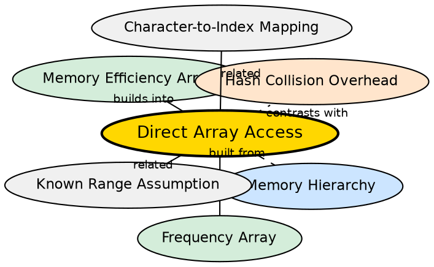

## Formal Definition

Direct array access is memory access via base-pointer-plus-offset addressing with no indirection, hashing, or collision resolution. Given a contiguous array and a valid index, the hardware computes the address in a single instruction: `address = base + index * element_size`. This is the fastest possible random-access lookup.

## Explanation

When you write `freq[3]`, the CPU computes `address_of_freq + 3 * sizeof(int)` and fetches the value. No hash function computation, no bucket traversal, no collision chains to follow. For character frequency problems with a small known domain, this makes arrays strictly faster than hash maps despite both being theoretically O(1).

## How It Works

1. The array is allocated as a contiguous block of memory
2. The compiler knows the base address and element size
3. At runtime, `freq[i]` compiles to a single `MOV` instruction with scaled index addressing
4. The memory access is predictable — adjacent elements are in adjacent memory locations (spatial locality)
5. No branching, no function calls, no hash computation

## Visual Explanation

```dot
digraph direct_access {
  rankdir=LR
  node [shape=record style=filled fillcolor="#f0f4ff" fontname="Helvetica"]

  MEM [label="Memory Layout\n{freq[0] | freq[1] | freq[2] | ... | freq[25]}" shape=record]
  CPU [label="CPU Instruction\nMOV eax, [ebx + i*4]"]
  INDEX [label="Index i=13"]
  ADDR [label="Address = base + 13*4"]

  INDEX -> ADDR
  ADDR -> CPU
  CPU -> MEM [label="single instruction"]
}
```

## Semantic Network



## Key Properties

- True hardware-level O(1) — single CPU instruction
- No hashing, no collisions, no amortization, no worst-case degradation
- Perfect spatial locality — sequential access is cache-friendly
- Indices must be valid (0 to size-1) — no bounds checking by default in C++
- Works only for contiguous, densely populated index ranges

## Connections

- Built from: [[character-to-index-mapping|Character-to-Index Mapping]] — direct access requires valid indices via conversion
- Builds into: [[frequency-array|Frequency Array]] — direct access is the fundamental advantage of arrays
- Builds into: [[memory-efficiency-array|Memory Efficiency of Array]] — minimal overhead per slot enables cache efficiency <!-- TODO: add backlink here -->
- Contrasts with: [[hash-collision-overhead|Hash Collision Overhead]] — hash maps trade direct access for flexibility <!-- TODO: add backlink here -->
- Related: [[known-range-assumption|Known Range Assumption]] — direct access requires known, bounded ranges <!-- TODO: add backlink here -->

## Edge Cases & Gotchas

- Out-of-bounds access leads to undefined behavior (silent memory corruption)
- C++ does not bounds-check array accesses — use `std::array` or `at()` for safety
- For negative indices (from incorrect `ch - 'a'` on uppercase), the behavior is undefined
- Cache misses can still occur for very large arrays (but for freq[26], the entire array fits in a single cache line)
- Direct access assumes contiguous allocation — vectors also provide this, but with heap allocation overhead

## Sources

- [[strings-summary|Strings (Character Hashing in C++)]]
