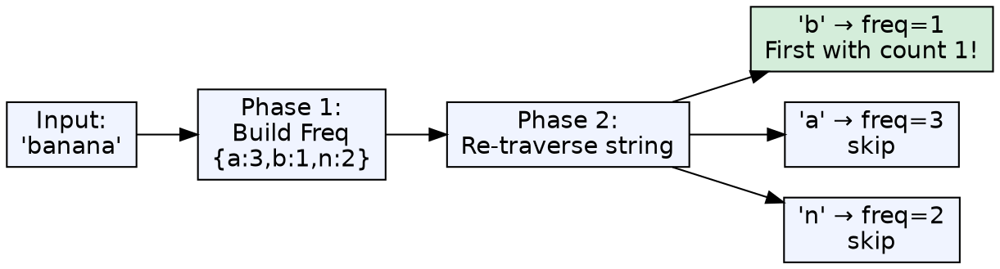
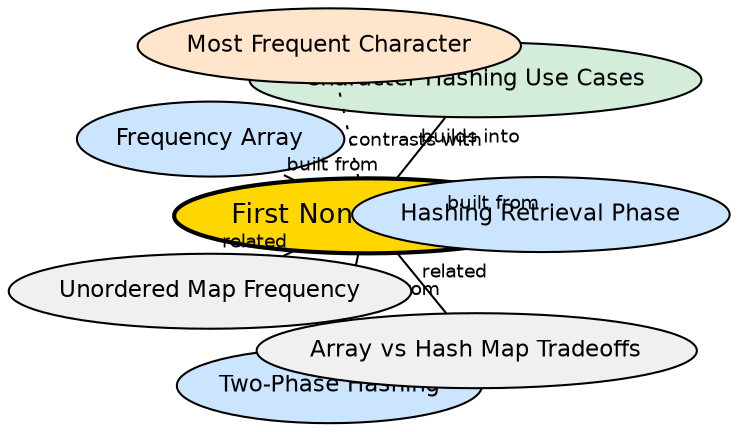

## Formal Definition

The first non-repeating character in a string is the character that appears exactly once and whose first occurrence has the smallest index in the original string. The hash-based solution uses Phase 1 to build frequencies, then re-traverses the original string in Phase 2 to find the first character with count 1.

$$ \text{first\_non\_repeat}(S) = S_i \text{ where } H[S_i] = 1 \text{ and } \forall j < i, H[S_j] \neq 1 $$

## Explanation

This problem is the first place where Phase 2 differs meaningfully from "traverse the structure." Instead of walking the frequency array, you walk the original string a second time and check each character's frequency. This preserves insertion order, which the frequency structure does not. It teaches that Phase 2 can re-traverse the input, not just the structure.

## How It Works

1. Phase 1: Build frequency array or hash map from the input string
2. Phase 2: Iterate through the original string character by character
3. For each character `ch`, check `freq[ch - 'a'] == 1` or `freq[ch] == 1`
4. Return the first character where count equals 1
5. If no character has count 1, return a sentinel (e.g., `'\0'` or `'$'`)

## Visual Explanation

## Semantic Network

## Key Properties

- O(n) Phase 1 + O(n) Phase 2 = O(n) total — two linear passes
- Preserves original string order in Phase 2 — this is why re-traversal is necessary
- The frequency structure alone cannot answer this question (it loses order information)
- Works with both arrays and hash maps — Phase 2 checks are O(1) in both
- Early termination possible — stop at the first match

## Connections

- Built from: [[hashing-retrieval-phase|Hashing Retrieval Phase]] — re-traversing input is a specific Phase 2 pattern
- Built from: [[two-phase-hashing|Two-Phase Hashing Paradigm]] — the canonical example of Phase 2 differing from Phase 1
- Built from: [[frequency-array|Frequency Array]] — one implementation choice
- Contrasts with: [[most-frequent-character|Most Frequent Character]] — same Phase 1, different Phase 2 strategy
- Related: [[anagram-detection-via-hashing|Anagram Detection]] — another Phase 2 variant
- Related: [[map-traversal-method|Hash Map Traversal Method]] — re-traversal works regardless of structure type

## Edge Cases & Gotchas

- All characters are repeating (e.g., "aabbcc"): no character has count 1 — must handle the no-solution case
- Empty string: return sentinel immediately
- Single character (e.g., "z"): that character is the answer — Phase 2 finds it on the first check
- Case sensitivity: 'A' and 'a' are different characters — the hash structure treats them separately
- For strings with only one unique character appearing once (e.g., "aaaabbbbccccd"): 'd' is the answer
- The naive solution without hashing is O(n²) — the hash structure reduces this to O(n)

## Sources

- [[strings-summary|Strings (Character Hashing in C++)]]
