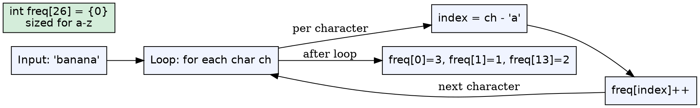
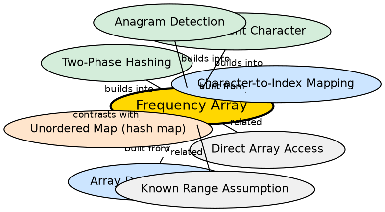

## Formal Definition

A frequency array is a fixed-size integer array where each index represents a distinct element from a known, finite domain, and the value at that index stores the count of occurrences of that element in a given dataset. For lowercase English letters, `int freq[26]` uses indices 0–25 to represent 'a'–'z'.

$$ \text{freq}[i] = \text{count of character } (i + \text{'a'}) \text{ in the input string} $$

## Explanation

A frequency array is the simplest possible hash-like structure: instead of hashing keys, you use the key itself (after a trivial transformation) as the array index. When the domain is small and known (like 26 lowercase letters), this gives you O(1) access with zero hashing overhead, zero collision handling, and minimal memory. It is the go-to data structure for character frequency problems in competitive programming and technical interviews.

## How It Works

1. Declare an array of size equal to the domain size (e.g., `int freq[26] = {0}` for lowercase letters)
2. Iterate through the input string character by character
3. Convert each character to its corresponding index using `ch - 'a'`
4. Increment `freq[index]` for each occurrence
5. To query, iterate indices 0 through size-1 and check non-zero values

## Mathematical Formulation

For a string $S$ of length $n$ over alphabet $\Sigma$ where $|\Sigma| = k$:

$$ \text{freq}[j] = \sum_{i=1}^{n} [S_i = \sigma_j] $$

where $[P]$ is the Iverson bracket (1 if $P$ true, 0 otherwise) and $\sigma_j$ is the $j$-th character of the alphabet.

## Visual Explanation

## Semantic Network

## Key Properties

- O(1) time for both insertion and lookup — true constant time, no amortization
- Memory proportional to domain size ($O(|\Sigma|)$), not input size ($O(n)$)
- Zero hashing overhead — no hash function computation, no collision resolution
- Only works when the domain is known, finite, and contiguous (or near-contiguous)
- Access pattern is predictable — sequential memory access when iterating

## Connections

- Built from: [[character-to-index-mapping|Character-to-Index Mapping]] — the `ch - 'a'` conversion is required to map characters to array indices
- Builds into: [[two-phase-hashing|Two-Phase Hashing]] — frequency arrays are the storage mechanism in Phase 1
- Builds into: [[most-frequent-character|Most Frequent Character]] — traversing the array finds the max frequency
- Builds into: [[anagram-detection-via-hashing|Anagram Detection]] — comparing two frequency arrays checks anagrams
- Contrasts with: [[unordered-map-frequency|Unordered Map for Frequency]] — maps offer flexibility but with hashing overhead
- Related: [[direct-array-access|Direct Array Access]] — no hashing means truly direct memory access

## Edge Cases & Gotchas

- Forgetting to zero-initialize the array (`int freq[26] = {0}`) leads to garbage values
- Using `ch - 'a'` on uppercase letters or non-alphabetic characters produces negative indices or out-of-bounds access
- Array size must match the domain — `freq[26]` fails for extended ASCII or Unicode
- Iterating all 26 slots when only 3 characters appeared wastes time (minor but relevant for sparse data)
- The array stores frequencies, not positions — cannot directly answer "where does character X first appear?"