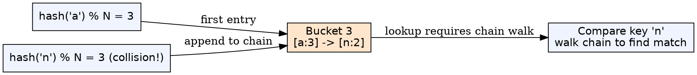
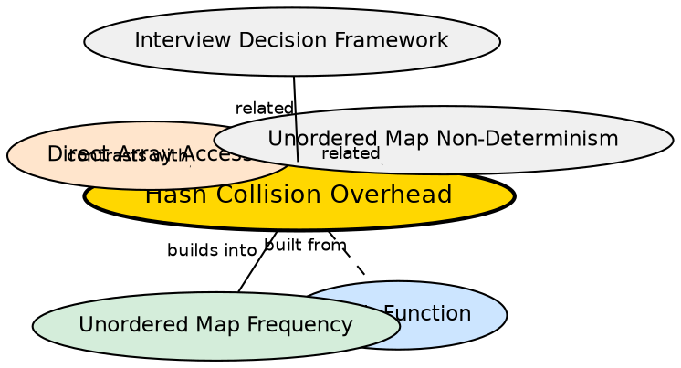

## Formal Definition

Hash collision overhead is the performance penalty incurred when two distinct keys hash to the same bucket in a hash table, requiring additional comparisons to resolve the collision. In `std::unordered_map`, collisions are resolved via chaining (linked lists), making lookup O(k) where k is the bucket chain length.

## Explanation

When you claim `unordered_map` offers O(1) access, the fine print is "average O(1) assuming a good hash function." Collisions occur when different characters produce the same hash bucket. The map must then walk a linked list of entries to find the right one. In the worst case (all keys colliding), lookup degrades to O(n). A frequency array never has this problem because array indexing is collision-free by design.

## How It Works

1. When inserting `freq[ch]`, the map computes `hash(ch) % bucket_count`
2. If the bucket is empty, the entry is placed directly
3. If the bucket already has entries (collision), the new entry is appended to the chain
4. On lookup, the map hashes the key, goes to the bucket, and walks the chain comparing keys
5. With a good hash function and adequate bucket count, chain length averages O(1)

## Visual Explanation

## Semantic Network

## Key Properties

- Average-case O(1) degrades to worst-case O(n) with poor hash distribution
- Frequency arrays have zero collision overhead — index can only map to one location
- C++ `std::unordered_map` uses chaining, so collisions add pointer indirection
- Rehashing (when load factor exceeds threshold) is O(n) — a costly amortized operation
- For small character sets (26 letters), maps are overkill and collisions are wasted work

## Connections

- Built from: [[direct-array-access|Direct Array Access]] — arrays bypass the collision problem entirely
- Builds into: [[unordered-map-frequency|Unordered Map for Frequency]] — collision handling is part of the map's implementation cost
- Builds into: [[hash-map-flexibility|Hash Map Flexibility]] — collision overhead is the cost of hash map flexibility
- Contrasts with: [[memory-efficiency-array|Memory Efficiency of Array]] — arrays have predictable, linear memory with no overhead
- Related: [[unordered-map-non-determinism|Unordered Map Non-Determinism]] — collision resolution affects iteration order

## Edge Cases & Gotchas

- For character keys, C++'s default hash for `char` is usually good — collisions are rare but possible
- String keys (for word frequency) have a higher collision probability than single chars
- A maliciously crafted input can trigger many collisions, causing O(n²) behavior — hash DoS attack
- The "average O(1)" claim assumes the hash function is well-distributed — never guaranteed for arbitrary keys
- Rehashing invalidates all iterators — a subtle bug when interleaving Phase 1 traversal with Phase 2