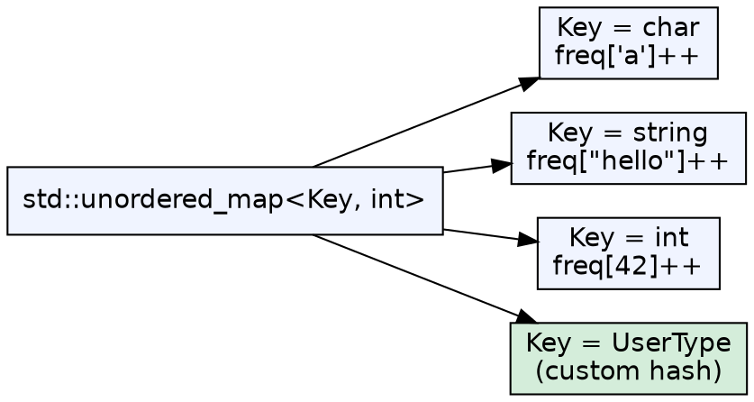
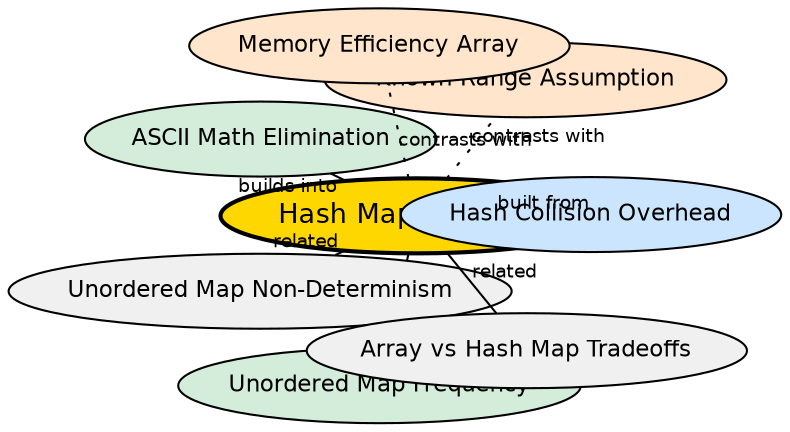

## Formal Definition

Hash map flexibility refers to the ability of `std::unordered_map` (and similar hash-based associative containers) to accept any hashable type as a key — including `char`, `int`, `string`, `long long`, and custom types with a user-provided hash function. This contrasts with frequency arrays, which are limited to integer-indexable domains.

## Explanation

A frequency array is hardcoded to a specific domain: `int freq[26]` works only for 26 lowercase letters. A hash map, by contrast, works for any type that has a hash function. Need to count word frequencies? `unordered_map<string, int>`. Need to count frequencies of `long long` IDs? `unordered_map<long long, int>`. The same data structure and the same `freq[key]++` pattern works across all key types.

## How It Works

1. C++ `std::unordered_map` uses `std::hash<Key>` to compute a `size_t` hash value for any key
2. The C++ standard library provides specializations of `std::hash` for all fundamental types
3. At insertion, the key is stored alongside the value in the bucket
4. On lookup, the key is hashed again, and the bucket chain is compared using `operator==`
5. For custom types, the programmer provides a `std::hash` specialization

## Visual Explanation

## Semantic Network

## Key Properties

- Works with any hashable type: `char`, `int`, `string`, `long long`, pointers, custom structs
- No compile-time domain constraint — the key type is a template parameter, not a fixed size
- Same code pattern (`freq[key]++`) regardless of key type
- Custom types require a custom hash function and `operator==`
- The flexibility comes at a cost: hash computation, dynamic memory allocation, pointer indirection

## Connections

- Built from: [[hash-collision-overhead|Hash Collision Overhead]] — flexibility requires hash functions, which can collide
- Builds into: [[unordered-map-frequency|Unordered Map for Frequency Counting]] — maps are the concrete implementation
- Builds into: [[ascii-math-elimination|ASCII Math Elimination]] — flexibility enables direct key usage
- Contrasts with: [[known-range-assumption|Known Range Assumption]] — arrays sacrifice flexibility for the assumption
- Contrasts with: [[memory-efficiency-array|Memory Efficiency of Array]] — flexibility costs memory

## Edge Cases & Gotchas

- `std::unordered_map` has no default hash for custom types — the compiler error is cryptic ("cannot convert from T to size_t")
- For string keys, the hash function iterates the entire string — O(len(key)) per hash, not just O(1)
- Floating-point keys are problematic: NaN != NaN per IEEE 754, so lookup fails
- Pointer keys hash by address, not by value — two different pointers with the same value are different keys
- The flexibility argument cuts both ways: too flexible means type errors surface at runtime or as linker errors