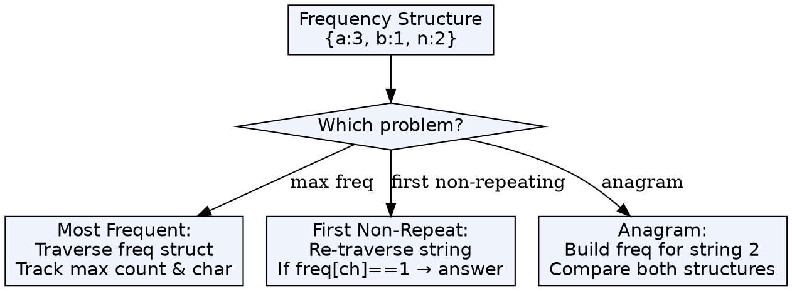
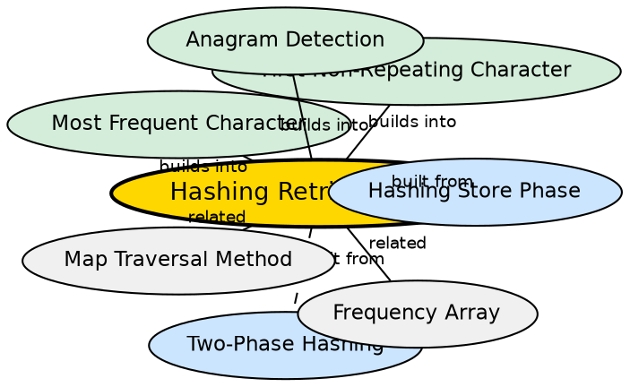

## Formal Definition

The hashing retrieval phase (Phase 2) is the process of querying the hash structure built in Phase 1 to produce the answer to a specific problem. The retrieval strategy varies by problem — traversing the structure, re-traversing the input, or comparing multiple structures.

## Explanation

Phase 2 is where the actual problem-solving happens. While Phase 1 is nearly identical across all frequency-counting problems, Phase 2 diverges dramatically. For "most frequent character" you traverse the structure tracking a max variable. For "first non-repeating" you re-traverse the original string. For "anagram" you compare two structures. Mastering Phase 2 is what separates strong candidates from beginners.

## How It Works

1. Determine the query pattern based on the problem
2. If finding max/min: traverse the hash structure, maintain tracking variables
3. If order-sensitive (first non-repeating): re-traverse the original string, check hash structure
4. If comparing two datasets: build two Phase 1 structures, then compare element by element

## Visual Explanation

## Semantic Network

## Key Properties

- Problem-dependent — Phase 2 looks different for every problem type
- May or may not be O(n) — depends on whether it traverses the structure or re-traverses the input
- For array-based Phase 1: traversal is over domain size (26), input re-traversal is over n
- For map-based Phase 1: traversal is over distinct elements (m ≤ n), input re-traversal is over n
- Some queries can short-circuit early (first non-repeating can stop at first match)

## Connections

- Built from: [[hashing-store-phase|Hashing Store Phase]] — Phase 2 consumes data produced by Phase 1
- Built from: [[two-phase-hashing|Two-Phase Hashing Paradigm]] — Phase 2 is the second half of the paradigm
- Builds into: [[most-frequent-character|Most Frequent Character]] — traverses structure tracking max
- Builds into: [[first-non-repeating-character|First Non-Repeating Character]] — re-traverses input checking structure
- Builds into: [[anagram-detection-via-hashing|Anagram Detection]] — compares two structures

## Edge Cases & Gotchas

- For first non-repeating character, the naive Phase 2 is O(n²) without the hash structure — the hash makes it O(n)
- Most frequent character with ties: which character do you return? The problem usually expects any or the first; clarify with the interviewer
- For maps, traversal order is non-deterministic — do not rely on order for correctness
- For anagrams, comparing two maps must account for characters present in one but not the other