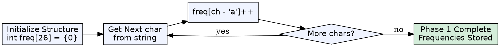
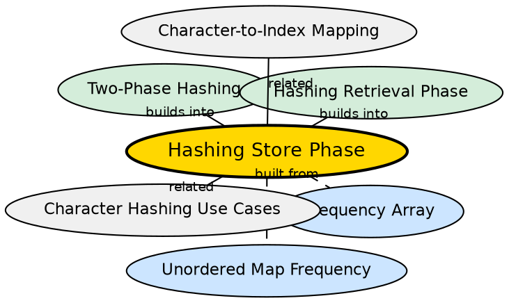

	
## Formal Definition

The hashing store phase (Phase 1) is the process of iterating over an input sequence and populating a hash structure (array or hash map) with frequency counts or other aggregated information. It is the data-ingestion step of the two-phase hashing paradigm.

## Explanation

Phase 1 is mechanical: choose your structure, loop through the input, and for each element, update its count. There is no decision-making, no comparisons, no conditional logic — just raw accumulation. This mechanical uniformity is why beginners can complete Phase 1 but then get stuck: the real thinking comes in Phase 2.

## How It Works

1. Initialize the structure: `int freq[26] = {0}` or `unordered_map<char,int> freq`
2. Iterate through each character in the input string
3. For arrays: compute `index = ch - 'a'`, then `freq[index]++`
4. For maps: simply `freq[ch]++`
5. After iteration, the structure contains all frequency information

## Visual Explanation

## Semantic Network

## Key Properties

- Always O(n) time — must visit each element once
- O(k) space where k is the domain size (for arrays) or O(m) where m is distinct elements (for maps)
- Structure choice (array vs map) is locked in during Phase 1
- No conditional logic — just increment operations
- Order of iteration does not matter for frequency counting

## Connections

- Built from: [[frequency-array|Frequency Array]] — one implementation choice for Phase 1
- Built from: [[unordered-map-frequency|Unordered Map for Frequency]] — another implementation choice for Phase 1
- Builds into: [[two-phase-hashing|Two-Phase Hashing Paradigm]] — Phase 1 is the first half of the paradigm
- Builds into: [[hashing-retrieval-phase|Hashing Retrieval Phase]] — Phase 1 feeds data into Phase 2
- Related: [[character-to-index-mapping|Character-to-Index Mapping]] — used only in the array variant of Phase 1

## Edge Cases & Gotchas

- For empty strings, Phase 1 produces an empty structure — Phase 2 must handle this
- For strings with a single character, the structure has one entry — still correct
- For maps, repeated `freq[ch]++` calls may trigger rehashing (amortized O(1), but costly)
- Phase 1 cannot answer any question about the data until it completes — it is purely a gathering phase