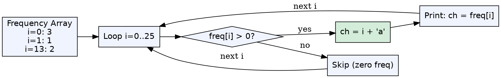
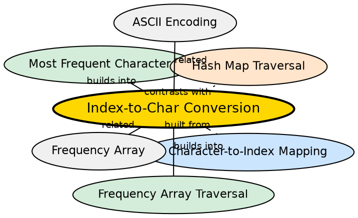

1
## Formal Definition

Index-to-character conversion is the inverse of character-to-index mapping. Given an integer index i (0–25 for lowercase English), adding the base character's ASCII value produces the corresponding character: `ch = i + 'a'`.

$$ \text{char}(i) = \text{ASCII}^{-1}(\text{ASCII}('a') + i) $$

## Explanation

After building a frequency array, the stored data is indexed numerically (0–25). To produce human-readable output (printing "a = 3" not "0 = 3"), you must convert each index back to its character. This is the reverse of the `ch - 'a'` mapping and uses `i + 'a'`.

## How It Works

1. During traversal of the frequency array, you have an index `i` (0 to 25)
2. Compute `char ch = i + 'a'`
3. Use `ch` for output or further processing
4. For i=0 → 'a', i=1 → 'b', ..., i=25 → 'z'

## Mathematical Formulation

$$ \text{char}(i) = i + 97 = i + \text{ASCII}('a') $$

$$ \text{char}(0) = 'a', \quad \text{char}(1) = 'b', \quad \dots, \quad \text{char}(25) = 'z' $$

## Visual Explanation

## Semantic Network

## Key Properties

- O(1) computation — simple integer addition
- Must match the base used in the forward mapping (`'a'` for `ch - 'a'`)
- Produces only lowercase letters when used with 0–25 indices
- No bounds checking — caller must ensure index is in valid range

## Connections

- Built from: [[character-to-index-mapping|Character-to-Index Mapping]] — index-to-character is the mathematical inverse of character-to-index
- Builds into: [[most-frequent-character|Most Frequent Character]] — after finding the max index, convert back to character
- Builds into: [[frequency-array|Frequency Array]] — used during the traversal phase to produce output
- Contrasts with: [[map-traversal-method|Hash Map Traversal Method]] — maps store key-value pairs directly, no conversion needed <!-- TODO: add backlink here -->

## Edge Cases & Gotchas

- Using `'A'` as base when the mapping used `'a'` produces wrong letters
- Indices outside 0–25 produce non-alphabetic characters (e.g., i=26 → '{')
- Forgetting this step and printing raw indices is a common beginner mistake
- When using uppercase mapping (`ch - 'A'`), the reverse must use `i + 'A'`

## Sources

- [[strings-summary|Strings (Character Hashing in C++)]]
