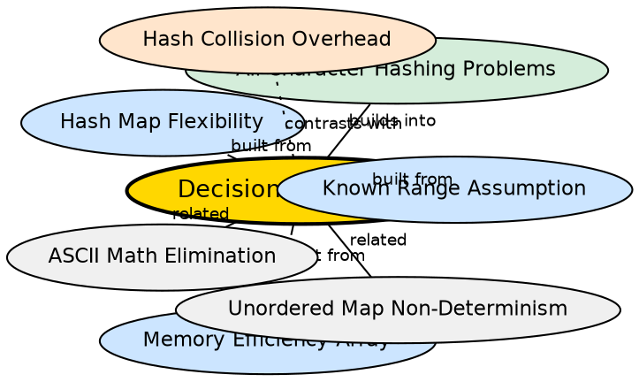

## Formal Definition

The array vs hash map decision framework is the process of choosing between `int freq[26]` and `unordered_map<char,int>` for character frequency problems based on three factors: the character range (known and small vs unknown or large), the performance requirements (speed vs flexibility), and the memory constraints (fixed vs dynamic).

## Explanation

When an interviewer asks "array or unordered_map?" the strong answer is not a dogmatic preference but a conditional analysis: "If the character range is fixed and small (a–z), I would use a frequency array because it is faster and uses less memory. If the range is large or unknown, I would use unordered_map because it is more flexible." This shows understanding of the tradeoffs rather than memorization.

## How It Works

1. **Check the range:** ask if the string is guaranteed lowercase letters
2. **If small and known (a–z, A–Z, digits):** use `int freq[N]` — faster, simpler, deterministic
3. **If large or unknown (Unicode, mixed, any char):** use `unordered_map` — flexible, no ASCII math
4. **If ordered output required:** use array (sorted by index) or `std::map` (tree-based order)
5. **If memory-constrained with sparse input:** consider map (stores only what appears)

## Visual Explanation

```dot
digraph decision_framework {
  rankdir=TB
  node [shape=box style=filled fillcolor="#f0f4ff" fontname="Helvetica"]

  RANGE [label="Character range\nknown and small?" shape=diamond]
  ARR_PATH [label="Use Frequency Array\nint freq[26]\nFast, deterministic\nLow memory", fillcolor="#d4edda"]
  MAP_PATH [label="Use Hash Map\nunordered_map<char,int>\nFlexible, no ASCII math", fillcolor="#cce5ff"]
  ORDER [label="Ordered output\nneeded?" shape=diamond]
  ORDER_ARR [label="Array (index-order) or\nstd::map (key-order)" fillcolor="#ffe5cc]

  RANGE -> ARR_PATH [label="yes\n(a-z)"]
  RANGE -> MAP_PATH [label="no\n(unknown)"]
  ARR_PATH -> ORDER [label="optional"]
  MAP_PATH -> ORDER [style=dashed]
  ORDER -> ORDER_ARR [label="yes"]
}
```

## Semantic Network



## Key Properties

- Range, speed, memory, and determinism are the four decision axes
- No universal "better" choice — the decision depends on the problem constraints
- Interviewers look for conditional reasoning, not a fixed preference
- The answer should be conversational: "Generally I'd use X, but if Y then Z"
- The framework applies beyond character hashing — it generalizes to any array-vs-hash decision

## Connections

- Built from: [[known-range-assumption|Known Range Assumption]] — the range check is the first decision step
- Built from: [[memory-efficiency-array|Memory Efficiency of Array]] — memory is a decision factor
- Built from: [[hash-map-flexibility|Hash Map Flexibility]] — flexibility is the deciding factor for unknown ranges
- Builds into: [[character-hashing-use-cases|Character Hashing Use Cases]] — the framework applies to every use case
- Contrasts with: [[hash-collision-overhead|Hash Collision Overhead]] — maps pay a collision cost that arrays avoid
- Related: [[ascii-math-elimination|ASCII Math Elimination]] — one reason to choose maps

## Edge Cases & Gotchas

- "I always use unordered_map because it's O(1)" is a naive answer — interviewers see it as a red flag (ignores constant factors)
- "I always use arrays because they're faster" misses the flexibility argument — it fails for mixed character sets
- The "hash map is O(1)" claim is average-case, not worst-case — a good candidate mentions this nuance
- For strings with only a few characters (n < 10), the overhead of any data structure may dominate — a simple loop without hashing could be faster
- The framework assumes you need to solve a frequency problem — if the problem doesn't require frequencies (e.g., simple character presence check), a `std::set` or `bool` array is more appropriate